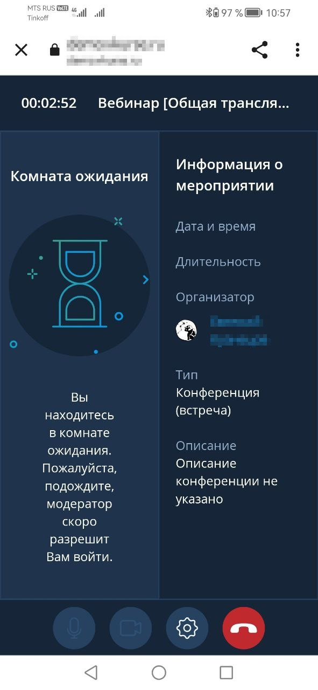

# Приложение для андроид

:::tip Установить приложение
Отсканируйте QR-код или перейдите по [ссылке](https://onelink.to/28kgbx)

:::

## Как создать чат

В данной статье вы научитесь создавать чаты в мобильном приложении ВКУРСЕ.

Функция чатов на нашей платформе позволяет быстро и удобно общаться с людьми в реальном времени.

Давайте рассмотрим как создать чат в нашем мобильном приложении.

**ШАГ 1:** Запуск приложения
Откройте приложение на своем телефоне. Подробней о том, как установить и авторизоваться в нашем мобильно приложении, вы можете узнать в этой статье.

**ШАГ 2:** Открытие блока по умолчанию
Приложение автоматически откроется в установленном по умолчанию блоке "Чаты".

**ШАГ 3:** Выбор контакта
Выберите необходимый контакт для общения при помощи кнопки "Новый чат" знак +, после выбора, нажмите зеленую галочку в правом углу экрана.

**ШАГ 5:** Автоматическое создание чата.
После нажатия на зеленую галочку, чат откроется автоматически.

### СПИСОК ДОСТУПНОГО ФУНКЦИОНАЛА В ЧАТАХ.

1. Просмотр профиля собеседника / Управление чатом позволяет:

- просмотреть профиль собеседника;
- открыть Галерею для удобного поиска вложений;
- заблокировать / разблокировать уведомления из данного чата;
- Очистить сообщения в чате;
- Удалить чат со всем содержимым.

2. Видеозвонок - позволяет звонить в видео формате;
3. Аудиозвонок - позволяет звонить в аудио формате;
4. Прикрепление файлов - позволяет вложить необходимый файл. Для передачи файлов и изображений необходимо разрешить приложению доступ к устройству;
5. Поле ввода текста - необходимо для отображения написанного сообщения;
6. Кнопка "Отправить" - при нажатии отправляет сообщение собеседнику.

## Как создать групповой чат

В данной статье вы научитесь создавать групповые чаты в мобильном приложении ВКУРСЕ.

Функция групповых чатов в нашем приложении позволяет объединить людей для совместного обсуждения и обмена идеями в одном пространстве. Это удобный способ поддерживать связь с командой, делиться информацией и моментально решать вопросы, обеспечивая эффективное взаимодействие в режиме реального времени.

В нашем приложении возможно создать групповой чат двумя способами, давайте рассмотрим оба.

### **СПОСОБ 1:** Создание группового чата из личного чата.

**ШАГ 1:** Переход в личный чат с любым собеседником.
Перейдите в в личный чат с любым собеседником - нажмите на аватарку профиля собеседника - Нажмите кнопку "Создать групповой чат"

**ШАГ 2:** Выбор необходимых собеседников.

Из появившегося списка выберете необходимых собеседников - проставьте галочки напротив их имен - нажмите зеленую галочку в правом верхнем углу.

**ШАГ 3:** Чат создан.

### СПОСОБ 2: Создание группового чата при помощи функции "Новый чат"

**ШАГ 1:** Вход в приложение.
Войдите в приложение, по умолчанию оно откроется во вкладке "Чаты".

**ШАГ 2:** Создание чата.
Во вкладке "Чаты" в верхнем правом углу нажмите на кнопку "Новый чат" знак +.

**ШАГ 3:** Выбор участников чата.
Из появившегося списка контактов, выберете необходимых участников или воспользуйтесь поиском, нажмите зеленую галочку в правом верхнем углу.

**ШАГ 4:** Чат создан.

### СПИСОК ФУНКЦИОНАЛА ГРУППОВОГО ЧАТА:

1. О чате - открывает функционал управления групповым чатом, позволяет:

- Изменить аватарку чата;
- Редактировать название;
- Просмотреть галерею чата, все вложения;
- Включить функцию сохранения истории чата для новых участников;
- Включить / выключить уведомления чата;
- Управлять участниками;
- Покинуть чат;
- Очистить чат;
- Удалить чат.

2. Групповой аудиозвонок - позволяет совершить аудиозвонок одновременно всем участникам чата;
3. Групповой видеозвонок - позволяет совершить видеозвонок одновременно всем участникам чата;
4. Прикрепление файлов - позволяет прикрепить файл;
5. Поле ввода текста - отображает набранный текст сообщения;
6. Кнопка отправить - отправляет сообщение.

## Как создать мероприятие / комнату в мобильном приложении

В данной статье вы научитесь создавать мероприятия и комнаты в мобильном приложении ВКУРСЕ.

В нашем приложении вы можете запланировать или создать мероприятие / комнату по готовым шаблонам. Данная функция позволяет создавать мероприятия, тогда, когда у вас нет доступа к персональному компьютеру.

Давайте рассмотрим, как создать мероприятие / комнату.

**ШАГ 1:** Вход в приложение.
Откройте приложение на своем мобильном устройстве

**ШАГ 2:** Переход во вкладку мероприятия / комнаты.
Перейдите во вкладку мероприятия / команты.

**ШАГ 3:** Создание мероприятия.
В правом верхнем углу экрана нажмите кнопку "Создать мероприятия / комнату" зеленый +, откроется функционал создания.

**ШАГ 4:** Установка параметров комнаты.
Задайте параметры мероприятия, например: название, шаблон, дату, время начала, продолжительность и.т.д.

**ШАГ 5:** Завершение создания. Начало мероприятия.
Нажмите зеленую галочку в верхнем правом углу, мероприятие готово. В зависимости от установленного времени, оно автоматически запустится и будет активным.

:::warning ВАЖНО

1. Детальная настройка мероприятия или комнаты доступна только в версиях приложения для персонального компьютера.
2. При создании мероприятия, можно запустить его сразу, при помощи функции "Начать сейчас", для этого на ШАГЕ 3 после нажатия на + выберете пункт "Начать сейчас".
3. Так как комната это мероприятие без начала и конца, при создании отсутствуют пункты настроек времени, это нормальная ситуация.
   :::

## Как подключиться в мероприятие

В данной статье вы научитесь подключаться в мероприятие как авторизованный пользователь в приложении ВКУРСЕ.

Подключение к мероприятию по ссылке - простой и удобный процесс. Вам не нужно искать и запоминать сложные данные для входа, что значительно ускоряет и упрощает подключение к мероприятию.

**ШАГ 1:** Запуск приложения.
Запустите приложение на вашем мобильном телефоне.

**ШАГ 2:** Переход во вкладку "Мероприятия".
В приложении перейдите во вкладку "Мероприятия"

**ШАГ 3:** Лента запланированных мероприятий.
После перехода вы увидите ленту запланированных мероприятий. Найдите необходимое.

**ШАГ 4:** Если мероприятие уже идет то Пользователь может:

- Принять
- Отклонить
- Войти

**ШАГ 5:** Вход в мероприятие.
Войдя в мероприятие (в зависимости от шаблона) можно:

- Включить/выключить микрофон
- Включить/выключить камеру
- Включить/выключить динамик
- Выйти из мероприятия (_не путать с завершением мероприятия_)
- Начать демонстрацию экрана
- Можно так же использовать чат внутри мероприятия.

## Как подключиться к мероприятию по ID

В данной статье вы научитесь подключаться к мероприятию по ID.

Подключение по ID делает процесс присоединения к мероприятию более быстрым, безопасным и удобным для пользователей.

Давайте рассмотрим этот процесс поэтапно.

**ШАГ 1:** Открыть приложение Connect на телефоне. В панели навигации (внизу) перейти в закладку "Мероприятия".

**ШАГ 2:** В правом верхнем углу нажать кнопку "ID".

**ШАГ 3:** В открывшемся окне в поле ввести ID мероприятия (цифры).

**ШАГ 4:** Нажать кнопку "Подключиться".

**ШАГ 5:** В открывшемся окне становится доступен функционал:

- вкл/выкл микрофона
- вкл/выкл камеры
- вкл/выкл динамика
- выход из мероприятия
- кнопка "три горизонтальных точки" для настройки звука, смены камеры, поднятия руки, поделиться экраном.

**ШАГ 6:** При необходимости мероприятие можно (временно) покинуть, нажав на "красную" кнопку.

**ШАГ 7:** И при необходимости вернуться в мероприятие, нажав зеленую кнопку "Войти".

## Как подключиться к мероприятию по ID с ролью "Гость"

В данной статье вы научитесь подключаться к мероприятию по ID с ролью "Гость".

Подключение по ID делает процесс присоединения к мероприятию более быстрым, безопасным и удобным для пользователей.

Давайте рассмотрим этот процесс поэтапно.

**ШАГ 1:** Откройте приложение Connect на телефоне. Обязательно заполните поле "Сервер". Данные по серверу может предоставить организатор мероприятия.

**ШАГ 2:** В приветственном окне выберите "Подключиться по ID".

**ШАГ 3:** Заполните ID мероприятия и нажмите кнопку "Подключиться".

**ШАГ 4:** Нажать "Войти" в форме приглашения

**ШАГ 5:** В закладке "Гость" заполните поле "Имя" и нажмите "Войти".

**ШАГ 6:** В открывшемся окне станут доступны следующие функции:

- Включение/выключение микрофона
- Включение/выключение камеры
- Выход из мероприятия
- кнопка "три горизонтальных точки" для настройки звука, смены камеры, поднятия руки, поделиться экраном.

## Как подключиться в мероприятие при помощи мобильного браузера

В данной статье вы научитесь входить в мероприятие через мобильный браузер на платформе ВКУРСЕ.

Данная функция позволяет быстро подключиться к мероприятию, если в моменте у вас нет доступа к персональному компьютеру, либо если у вас нет личного кабинета от платформы ВКУРСЕ.

**ШАГ 1:** Переход по ссылке
Перейдите по полученной ссылке кликнув на нее, чтобы попасть на мероприятие. Ссылку вы можете получить в приглашением на посту либо запросить у организатора.

**ШАГ 2:** Ввод имени участника
В открывшемся окне браузера введите ваше имя в соответствующем поле.

**ШАГ 3:** Вход в систему
Нажмите кнопку "Войти", чтобы продолжить.

**ШАГ 4: Ввод пароля (если требуется)**
Если мероприятие защищено паролем, введите его в соответствующее поле.

**ШАГ 5: Подтверждение входа**
Нажмите кнопку "Войти", чтобы завершить вход.

**ШАГ 6: Ожидание в комнате (если предусмотрено)**
Если мероприятие подразумевает комнату ожидания, вы будете перемещены туда и останетесь до согласования вашего присутствия.

**ШАГ 7: Открытие окна мероприятия** После согласования открывается новое окно с доступом к мероприятию.

