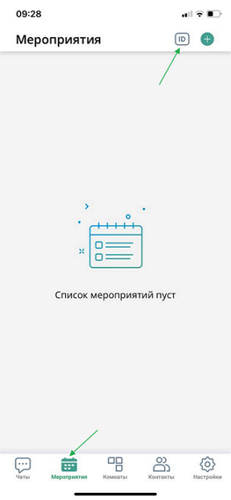

# Приложение ВКУРСЕ для iOS

:::tip Установить приложение
Отсканируйте QR-код или перейдите по [ссылке](https://onelink.to/28kgbx)

:::

## Как создать чат

В данной статье вы научитесь создавать чаты в мобильном приложении ВКУРСЕ.

Функция чатов на нашей платформе позволяет быстро и удобно общаться с людьми в реальном времени. Давайте рассмотрим как создать чат в нашем мобильном приложении.

**ШАГ 1:** Откройте приложение на своем телефоне. Подробней о том, как установить и авторизоваться в нашем мобильно приложении, вы можете узнать в этой статье.

**ШАГ 2:** Приложение автоматически откроется в установленном по умолчанию блоке "Чаты".

**ШАГ 3:** Выберите необходимый контакт для общения при помощи кнопки "Новый чат" знак +, после выбора, нажмите зеленую галочку в правом углу экрана.

**ШАГ 4:** После нажатия на зеленую галочку, чат откроется автоматически.

### СПИСОК ДОСТУПНОГО ФУНКЦИОНАЛА В ЧАТАХ.

1. Просмотр профиля собеседника / Управление чатом позволяет:

- просмотреть профиль собеседника;
- открыть Галерею для удобного поиска вложений;
- заблокировать / разблокировать уведомления из данного чата;
- Очистить сообщения в чате;
- Удалить чат со всем содержимым.

2. Видеозвонок - позволяет звонить в видео формате;
3. Аудиозвонок - позволяет звонить в аудио формате;
4. Прикрепление файлов - позволяет вложить необходимый файл. Для передачи файлов и изображений необходимо разрешить приложению доступ к устройству;
5. Поле ввода текста - необходимо для отображения написанного сообщения;
6. Кнопка "Отправить" - при нажатии отправляет сообщение собеседнику.

## Как создать групповой чат

В данной статье вы научитесь создавать групповой чат в приложении для смартфона.

Групповые чаты обеспечивают эффективную коммуникацию, координацию, вовлеченность участников и доступность информации, что делает их полезным инструментом для совместной работы и взаимодействия.

Далее рассмотрим этот процесс пошагово.

**ШАГ 1:** Войти в приложение под своим Логином и Паролем. Перейти во вкладку "Чаты".

**ШАГ 2:** В правом верхнем углу экрана нажать кнопку **плюс**
.

**ШАГ 3:** В списке контактов или при помощи функции поиска выделить необходимые контакты, они добавятся в список создаваемого группового чата.

**ШАГ 4:** Далее нажать на кнопку "Зеленая галочка" справа вверху.

**ШАГ 5:** После этого производится переход в функционал чата. Чат будет присутствовать во вкладке "Чаты" до его удаления.

### СПИСОК ДОСТУПНОГО ФУНКЦИОНАЛА В ЧАТАХ

- написать сообщение
- совершить аудиозвонок/видеозвонок

Нажав на "иконку" чата, можно перейти в "Информацию о чате". В открывшейся вкладке есть возможность внести изменения:

- добавить участников
- вкл/выкл уведомлений чата
- очистить содержимое чата
- удалить чат
- выйти из чата
- сменить название общего чата
- сменить роли у участников чата (назначить: администратором, владельцем)
- изменить фото аватара

## Как создать мероприятие/комнату в мобильном приложении

В данной статье вы научитесь создавать мероприятия и комнаты в мобильном приложении ВКУРСЕ.

В нашем приложении вы можете запланировать или создать комнату/мероприятие по готовым шаблонам. Данная функция позволяет создавать мероприятия тогда, когда у вас нет доступа к персональному компьютеру.

Давайте рассмотрим, как создать комнату/мероприятие.

**ШАГ 1:** Откройте приложение на своем мобильном устройстве и перейдите во вкладку комната/мероприятие.

**ШАГ 2:** В правом верхнем углу экрана нажмите кнопку "Создать комнату/мероприятие" зеленый +, откроется функционал создания.

**ШАГ 3:** Задайте параметры комнаты/мероприятия, например: название, шаблон, дату, время начала, продолжительность и т.д.

**ШАГ 4:** Нажмите зеленую галочку в верхнем правом углу, комната/мероприятие готовы.

:::warning ВАЖНО

1. Детальная настройка мероприятия или комнаты доступна только в версиях приложения для персонального компьютера.
2. При создании мероприятия можно запустить его сразу при помощи функции "Начать сейчас", для этого на ШАГЕ 2 после нажатия на + выберете пункт "Начать сейчас".

3. Так как комната это мероприятие без начала и конца, при создании отсутствуют пункты настроек времени, это нормальная ситуация.
   :::

## Как подключиться к мероприятию

В данной статье вы узнаете как подключаться к мероприятию со смартфона.

Это позволит быть вам более мобильным и гибким, даст возможность участвовать в видеоконференции из любого места.

Давайте рассмотрим подключение к мероприятию пошагово.

**ШАГ 1:** Запустить приложение на телефоне, перейти во вкладку Мероприятия.

**ШАГ 2:** В ней могут находиться запланированные мероприятия и текущие, в которые приглашен зарегистрированный пользователь. Если мероприятие уже идет, то пользователь может:

- Принять
- Отклонить
- Войти.

**ШАГ 3:** Войдя в мероприятие (в зависимости от шаблона), можно:

- Включить/выключить микрофон
- Включить/выключить камеру
- Выйти из мероприятия (не путать с завершением мероприятия)
- Начать демонстрацию экрана.

**ШАГ 4:** Можно также использовать чат внутри мероприятия.

## Как подключиться к мероприятию по ссылке

В данной статье вы научитесь подключаться к мероприятию по ссылке.

Подключение к мероприятию по ссылке - простой и удобный процесс. Вам не нужно искать и запоминать сложные данные для входа, что значительно ускоряет и упрощает подключение к мероприятию.

Давайте рассмотрим весь путь подключения пошагово.

ШАГ 1: Получите ссылку на подключение к мероприятию.
Ссылку можно получить по почте или через чат приложения Connect.

ШАГ 2: Нажмите (выберите) на ссылку. Она перенаправляет на сервис подключения.

ШАГ 3: Сервис предложит открыть страницу в приложении "Connect". Нажать "Открыть в приложении".

ШАГ 4: На экране появится форма входа в "мероприятие". Нажать "Войти".

ШАГ 5: В открывшемся окне становится доступен функционал:

- вкл/выкл микрофона
- вкл/выкл камеры
- вкл/выкл динамика
- выход из мероприятия
- кнопка "три горизонтальных точки" для настройки звука, смены камеры, поднятия руки, поделиться экраном.

## Как подключиться к мероприятию по ID

В данной статье вы научитесь подключаться к мероприятию по ID.

Подключение по ID делает процесс присоединения к мероприятию более быстрым, безопасным и удобным для пользователей.

Давайте рассмотрим этот процесс поэтапно.

ШАГ 1: Открыть приложение Connect на телефоне. В панели навигации (внизу) перейти в закладку "Мероприятия". В правом верхнем углу нажать кнопку "ID".

ШАГ 2: В открывшемся окне в поле ввести ID мероприятия (цифры). Нажать кнопку "Подключиться".

ШАГ 3: В открывшемся окне становится доступен функционал:

- вкл/выкл микрофона
- вкл/выкл камеры
- вкл/выкл динамика
- выход из мероприятия
- кнопка "три горизонтальных точки" для настройки звука, смены камеры, поднятия руки, поделиться экраном.

ШАГ 4: При необходимости мероприятие можно (временно) покинуть, нажав на "красную" кнопку.

ШАГ 5: И при необходимости вернуться в мероприятие, нажав зеленую кнопку "Войти".

## Как подключиться к мероприятию по ID с ролью "Гость"

В данной статье вы научитесь подключаться к мероприятию по ID с ролью "Гость".

Подключение по ID делает процесс присоединения к мероприятию более быстрым, безопасным и удобным для пользователей.

Давайте рассмотрим этот процесс поэтапно.

ШАГ 1: Откройте приложение Connect на телефоне. Обязательно заполните поле "Сервер". Данные по серверу может предоставить организатор мероприятия.

ШАГ 2: В приветственном окне выберите "Подключиться по ID".

ШАГ 3: Заполните ID мероприятия и нажмите кнопку "Подключиться".

ШАГ 4: Нажать "Войти" в форме приглашения

ШАГ 5: В закладке "Гость" заполните поле "Имя" и нажмите "Войти".

ШАГ 6: В открывшемся окне станут доступны следующие функции:

- Включение/выключение микрофона
- Включение/выключение камеры
- Выход из мероприятия
- кнопка "три горизонтальных точки" для настройки звука, смены камеры, поднятия руки, поделиться экраном.

## Как подключиться к мероприятию через браузер без перехода в приложение

В данной статье вы научитесь подключаться к мероприятию через браузер без приложения.

Подключение через браузер устраняет необходимость в установке приложений, поддерживает современные веб-стандарты и обеспечивает быстрый доступ с любого устройства.

Далее рассмотрим этот процесс поэтапно.

ШАГ 1: Перейдите по полученной ссылке на мероприятие. В открывшемся окне браузера введите ваше имя в пустое поле и нажмите кнопку "Войти".

ШАГ 2: Если мероприятие защищено паролем, введите соответствующий пароль в указанное поле, затем нажмите кнопку "Войти" снова.

ШАГ 3: Если мероприятие требует промежуточного ожидания, вы попадете в комнату ожидания и будете ждать согласования вашего присутствия.

ШАГ 3.1: Разрешите использование микрофона и камеры, когда появится соответствующий запрос.

ШАГ 4: После этого откроется новое окно мероприятия.

## Как настроить доступы Safari на мобильном устройстве

В данной статье вы научитесь настраивать доступы Safari.

При переходе в мероприятие по ссылке в браузере Safari на мобильном устройстве для включения камеры необходимо проверить наличие разрешение на использование камеры.

Для этого выполните следующие действия:

ШАГ 1: Откройте Safari на мобильном устройстве, вставьте ссылку на мероприятие в адресную строку и перейдите по ней. Введите имя и нажмите кнопку «Войти».

 

ШАГ 2: При появлении уведомления обязательно нажмите кнопку «Разрешить», чтобы предоставить доступ к камере.

 

ШАГ 3: Нажмите на кнопку микрофона, убедитесь, что в адресной строке красный значок микрофона не перечеркнут. Включите камеру.

 

ШАГ 4: После включения камеры убедитесь, что значок камеры в адресной строке не перечеркнут и кнопка камеры поменяла цвет.

 
