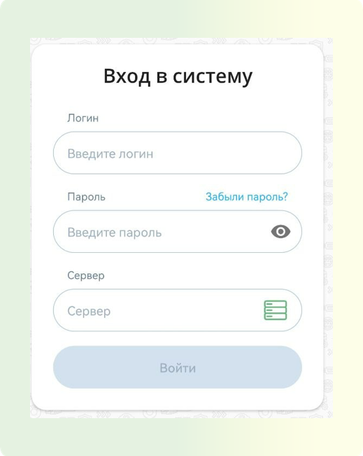

# Частые вопросы

:::tip Содержание
[[toc]]
:::

## Термины и Наименования

**Мероприятие** - сеанс видео- / аудиосвязи в Платформе, (однократный, периодический или постоянный). В зависимости от настроек шаблона, мероприятия делятся на следующие форматы: конференция, вебинар, лекция и селектор

**Видеоконференция** - мероприятие взаимодействия двух и более удалённых абонентов, при которой между ними возможен обмен аудио- и видеоинформацией в реальном времени, с учётом передачи управляющих данных

**Meeting** - Все участники видят и слышат друг друга

**Вебинар** - Слушатели видят только докладчика и модератора и могут задавать вопросы

**Вебинар Автозапись** - Слушатели видят только докладчика и модератора и могут задавать вопросы

**Встреча Автозапись HD** - Слушатели видят только докладчика и модератора и могут задавать вопросы

**Селектор HD** - Рядовые участники видят и слышат только докладчиков и модераторов

**Лекция** - Рядовые участники видят только докладчиков и модераторов, но слышат всех

**Докладчик** - пользователь, который выступает и транслирует определённый(ые) медиапоток(и) участникам мероприятия, аналогично выступающему в режиме реального времени. Докладчику недоступны настройки мероприятия, он не может назначать роли другим участникам

**Модератор** - пользователь, осуществляющий непосредственное управление мероприятием. Модератор управляет общим качеством трансляции для всех участников, ролями и доступными для участников функциями

**Роли** - способ группировки пользователей и участников мероприятий по набору прав, которыми они обладают в Платформе или мероприятии

**ЛК** - личный кабинет пользователя

## Как написать в поддержку

Написать в техническую поддержку можно на электронный адрес:

e-mail: support@vkurse.ru
телефон: +7 499 288 11 23

## Необходимые данные для запуска продукта на устройствах.

Для зарегистрированного пользователя необходимы следующие данные.

### Для подключения посредством браузера:

1. Ссылка на страницу регистрации
2. Логин
3. Пароль

### Для подключения посредством Desktop (Приложение ПК):

1. Логин
2. Пароль
3. Адрес сервера

### Для подключения посредством мобильного клиента:

1. Логин
2. Пароль
3. Адрес сервера

## Роли участников мероприятий.

**Организатор** - зарегистрированный пользователь, создавший мероприятие с максимальным набором прав, доступных для мероприятия. Он выполняет планирование, модерирование, административные функции, включая удаление мероприятия.

**Модератор** - пользователь, осуществляющий управлением мероприятием. Модератор управляет качеством трансляции для всех участников, ролями и правами доступа для других участников.

**Докладчик** - пользователь, который выступает и транслирует контент участникам мероприятия. Ему недоступны настройки мероприятия, он не может назначать роли другим участникам.

## Добавление файлов в мероприятие (форматы)

1. Находясь в мероприятии нажмите кнопку "Файлы" в правом правом углу в виде папки

<!-- TODO: вставить видео https://help.vkurse.ru/books/casto-zadavaemye-voprosy-meropriiatiia/page/dobavlenie-failov-v-meropriiatie-formaty -->

2. В открывшемся окне нажать кнопку "Загрузить" и выбрать необходимые материалы для загрузки и демонстрации.

Загружаемые файлы могут быть различных форматов:

- офисные текстовые: `.pdf`, `.doc`, `.docx`, `.txt`, `.rtf`, `.odt`, `.ppt`, `.pptx`, `.pot`, `.pps`, `.xls`, `.xlsx`, `.xlt`,
- с изображениями: соответствующие форматы, поддерживаемые используемым браузером (`.jpeg`, `.gif`, `.png`, `.bmp` и т. д.),
- с видео: соответствующие форматы, поддерживаемые используемым браузером (`.mp4`, `.flac` и т. д.)

Самым распространенным форматом является `pdf`.

## Почему камера и звук могут не работать?

Если на ПК установлен антивирус Касперский или Доктор веб - могут быть недоступны устройства ввода вывода звука и видео.
Решение: Внести браузер google chrome или конкретно сайт платформы ВКС в доверенные в настройках Антивируса.

2. Если на ПК установлены другие ВКС приложения (мтс линк, zoom или иные) – при входе на Вкурсе могут быть недоступны устройства ввода вывода звука и видео, так как по умолчанию они подтягиваются в ранее используемые системы.

:::tip Решение
Полностью закрыть в операционной системе другие ВКС приложения, перезагрузить страницу мероприятия
:::

<!-- TODO: закончить фак с раздела Восстановление пароля в ЛК (Браузер) -->
