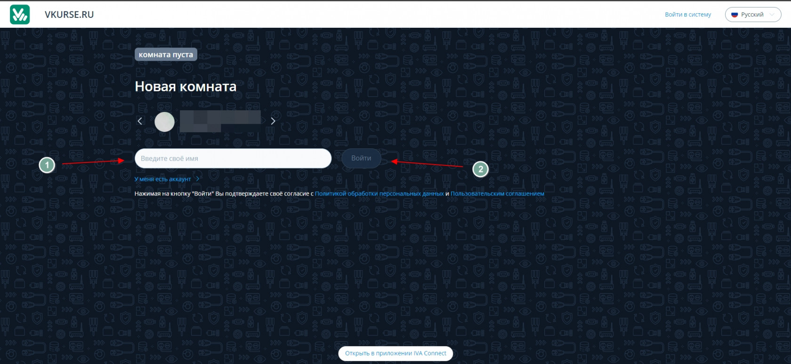
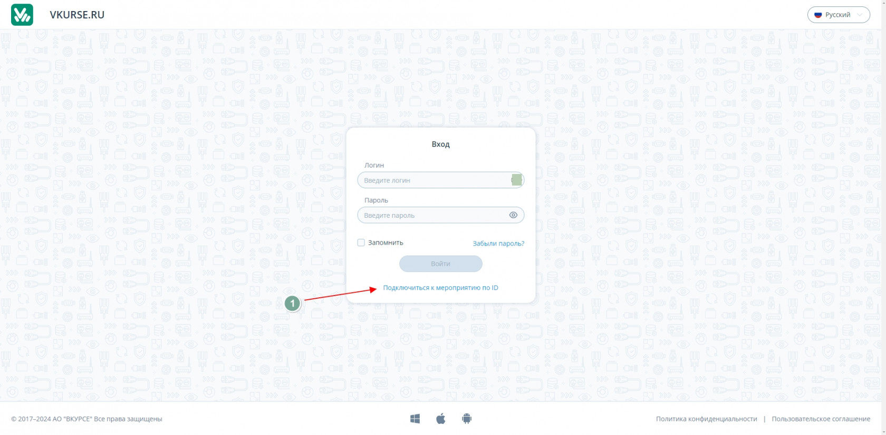
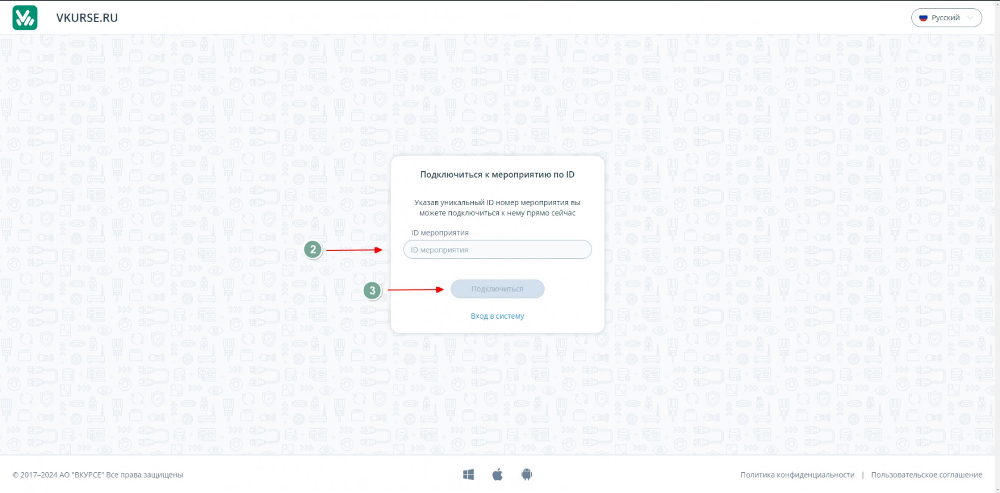
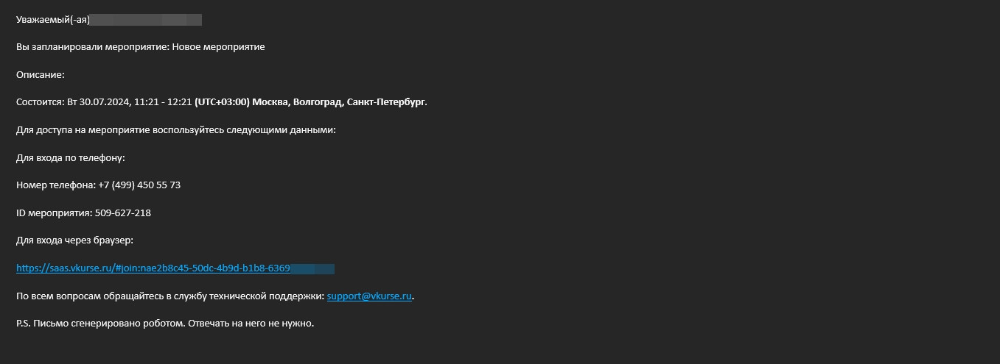
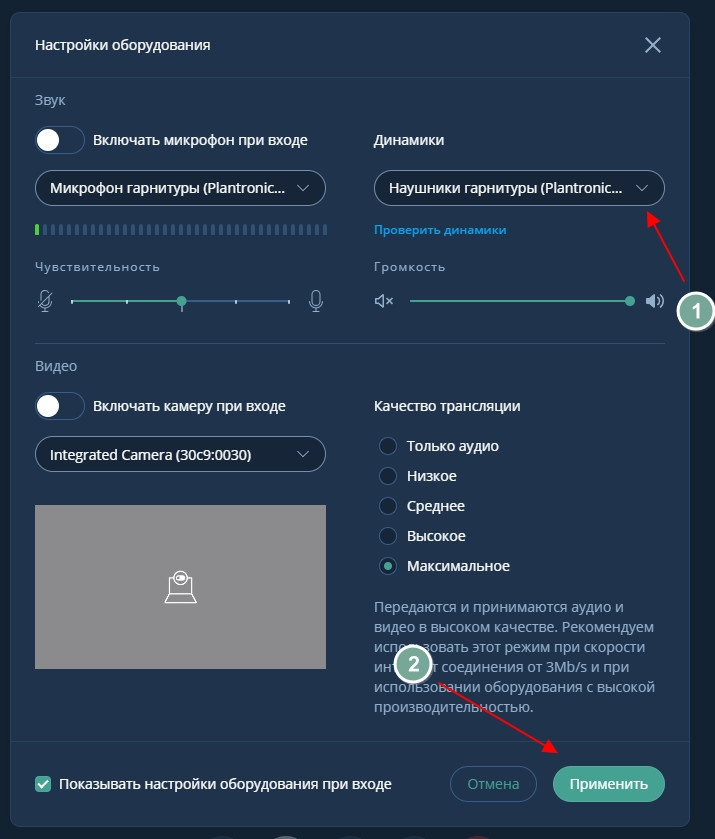
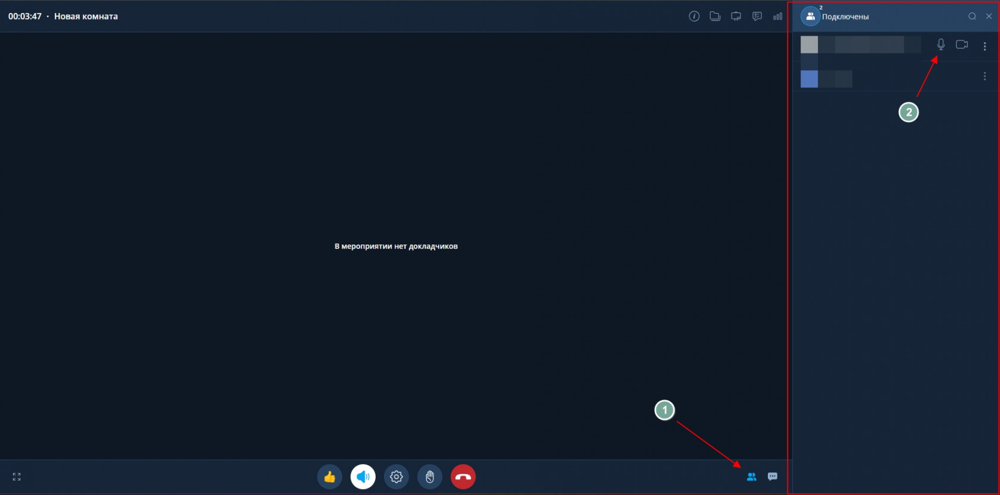
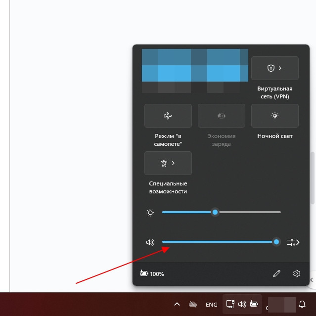
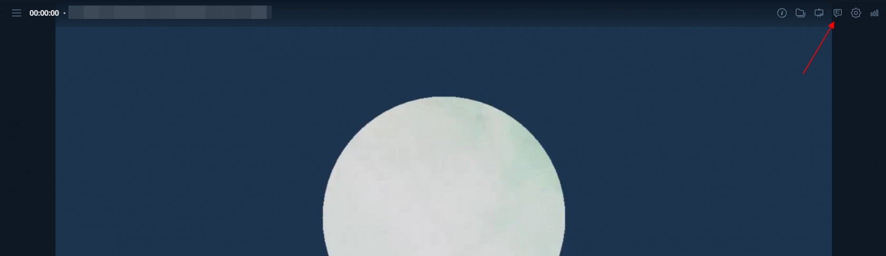
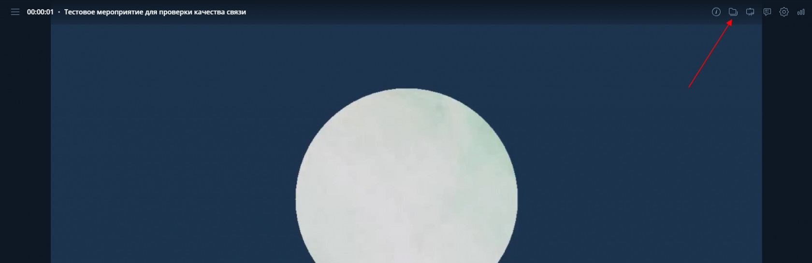

# Помощь участникам мероприятий

## Подключение к Мероприятию

**- Нужно ли регистрироваться на платформе, чтобы попасть в мероприятие?**

Ответ: Нет, регистрироваться необязательно. На платформе есть функционал перехода в мероприятие по гостевой ссылке или по ID мероприятия.

При переходе в мероприятие по гостевой ссылке или ID вы попадете на посадочную страницу мероприятия, необходимо:

1\. Ввести ваше имя, которое будет отображаться в мероприятие.

2\. Нажать кнопку Войти (если кнопка Войти не активна, значит мероприятие еще не началось).

**Подключение по ID мероприятия.**

1\. Перейдите по ссылке на платформу ВКС.

2\. На странице авторизации нажмите “Подключиться к мероприятию по ID**”**

3\. Откроется экран ввода ID

4\. Введите ID мероприятия и нажмите кнопку подключиться.

5\. Ввести ваше имя, которое будет отображаться в мероприятие. Нажмите кнопку “Войти”

**- Можно ли поделиться своей ссылкой, чтобы пригласить в мероприятие кого-то еще?**

Ответ: Если вас пригласили по электронной почте при этом приглашение пришло с электронного адреса <noreplay@vkurse.ru> то вам была направлена персональная ссылка для подключения к мероприятию. В таком случае, подключиться по данной ссылке сможете только вы.

Если организатор мероприятие прислала вам ссылку лично, то скорее всего она гостевая, с доступом для всех участников. В таком случае вы можете ее пересылать другим участникам, если организатор мероприятия не против.

**- Почему при подключении мне не слышно докладчика?**

Ответ: Неслышно докладчика может быть по нескольким причинам:

1\. У вас выключен звук в мероприятии. Проверьте активирован ли у вас звук на мероприятии. Кнопка должна быть белого цвета.

Если кнопка белого цвета но звука нет. Проверьте настройки оборудования:

- Кнопка “Шестеренка”
- Появится окно настройки.
- Шаг 1. Раскрыть список и выбрать исправные внешние динамики или динамики наушников
- Шаг 2. Применить настройки после выбора.

2\. У докладчика выключен микрофон

Для того чтобы проверить включен ли микрофон докладчика:

- Шаг 1. На панеле управления нажать кнопку “Участники”
- Шаг 2. В списке участников найти участника с ролью “Докладчик” проверить статус микрофона, если он потухших значит микрофон не включен.

3\. Уровень громкости на вашем ПК или мобильном устройстве снижен до 0.

Уровень громкости можно проверить на рабочей панеле Windiws (на скриншоте указана Windows 11)

4\. Неисправности внешнего оборудования или его отсутствие.

В данном случае необходимо обратиться к техническому специалисту так как неисправности внешнего оборудования может выявить только технический специалист.

**- Могу ли я включить видео и звук, если я участник вебинара?**

Ответ: Нет, по умолчанию рядовые участники Вебинара не могут включать камеру и микрофон.

**- Как поучаствовать в опросе во время мероприятия?**

В верхнем правом углу на панели мепроприятия есть функция “Опросы”, для того чтобы поучаствовать необходимо перейти в нее и принять участие в необходимом опросе.

**- Где можно скачать файлы из мероприятия?**

Ответ: Файлы мероприятия можно скачать в хранилище мероприятия. В верхнем правом углу панели мероприятия функция “Файлы”

Если файл скачать не получается, значит организатор ограничил возможность скачивания файла записи. В таком случае файл записи необходимо запросить у организатора мероприятия.
