# Аналитика по платформе ВКУРСЕ

## Доступ и возможности

Каждый пользователь может видеть статистику по своим мероприятиям в разделе «Настройки» - «Статистика мероприятий». Но чтобы отслеживать общую статистику по всем мероприятиям и пиковым значениям в рамках купленной лицензии разработан отдельный сервис [stats.vkurse.ru](https://stats.vkurse.ru/login)

:::warning ДОСТУП
Чтобы получить доступ к данному сервису, необходимо сделать запрос на <support@vkurse.ru>, после чего вам направят пароль для входа.
:::

После входа на сайт прежде всего необходимо указать даты — за какой период вы хотите проанализировать показатели и нажать «Показать статистику».

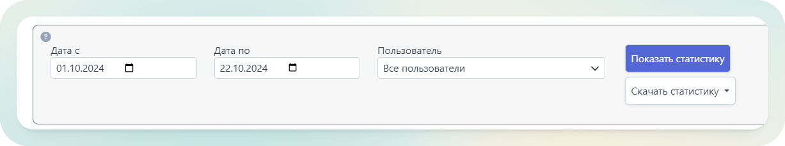

Доступна возможность «Скачать статистику» за выбранный период в `excel` и `csv`, в этом случае в файле будут отражены все пиковые значения и используемые клиенты за каждый день выбранного промежутка. На сайте же отображается сводная информация с пиковыми значениями за весь период,

Прежде всего с правой стороны отражены базовые показатели:

1.  Использованное хранилище.

Первый показатель — какой объем был загружен в заданный период, ниже в скобках — общий используемый объем.

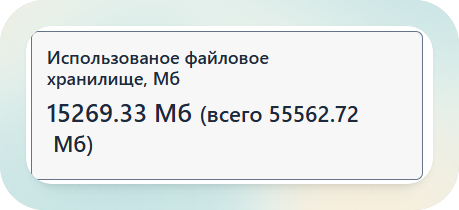

2.  Всего зарегистрированных пользователей за период.

Первый показатель — сколько было зарегистрировано новых пользователей за выбранный период, ниже в скобках — сколько было зарегистрировано всего по вашей компании.

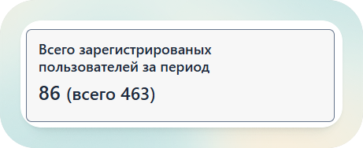

С левой же стороны отражены основные пиковые значения использования лицензии, как в примере ниже:

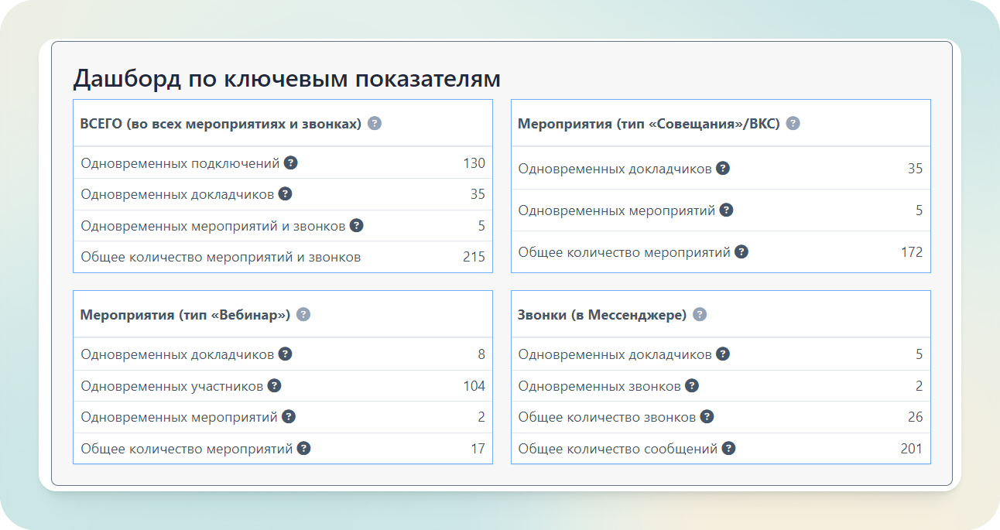

## Структура дашборда

Дашборд состоит из 4 разделов:

1.  **ВСЕГО (во всех мероприятиях и звонках**). Так как тариф имеет ограничение по количеству одновременных докладчиков и параллельных мероприятий, рекомендуем особенно обращать внимание на эти показатели.

    - Одновременных подключений — учитывает все типы подключений, в любой роли и в любом типе мероприятия, включая P2P звонки в мессенджере в один момент времени.
    - Одновременных докладчиков. В этот показатель идут все участники мероприятий типа «Встреча» («Конференция»), участники с ролью докладчик или модератор в вебинаре, а также участники P2P звонков в мессенджере в один момент времени
    - Одновременных мероприятий = параллельных мероприятий — включает все типы мероприятий и онлайн-звонки в мессенджере
    - Общее количество мероприятий и звонков — общее число за весь выбранный период, не имеет ограничений в тарифе

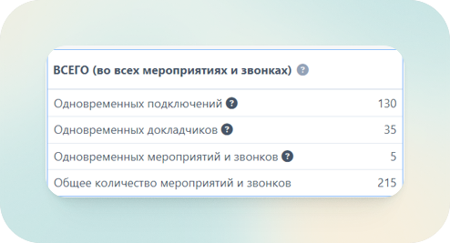

2.  **Мероприятия (тип Совещания/ВКС)** — отображает статистику только для шаблонов «Встреча» («Конференция»). На платформе также доступны специальные шаблоны «Селектор» и «Лекция», они также относятся к этому типу мероприятий.

    - Показатель «одновременных докладчиков» отражает по сути всех участников в пике, не зависимо от роли, так как имеются ввиду `webrtc` подключения.
    - Показатель одновременных мероприятий показывает пересечения только по данному типу мероприятий

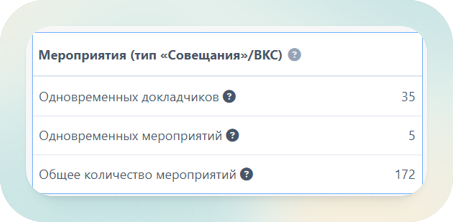

3.  **Мероприятия (тип Вебинар)** — отображает статистику только для шаблонов «Вебинар».

:::warning ВАЖНО
При таком типе подключения участники с ролью «Модератор» и «Докладчик» подключаются как `WebRTC`, а участники как `WebRTMP`, поэтому не имеют возможность включать камеру и звук. Поэтому в статистике отдельно выделены эти показатели:

- Одновременные докладчики — Пользователи `WebRTC` в пиковом значении по всем мероприятиям шаблона «Вебинар»
- Одновременные участники — Пользователь `WebRTMP` в пиковом значении по всем мероприятиям шаблона «Вебинар»
- Одновременные мероприятия — показатель только для данного типа мероприятий.
  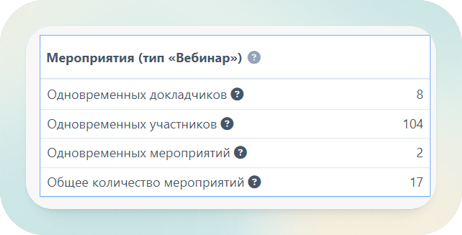
  :::

4.  **Звонки (в мессенджере)** — `P2P` звонки доступные между зарегистрированными пользователям в разделе «Чаты» без создания мероприятий или перехода в комнаты. Участники таких звонков определяются как докдадчики. Звонки могут быть как персональные, так и групповые. Также статистика отображает общее количество всех сообщений в мессенджере.

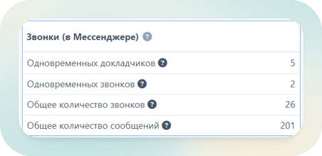

Далее под дашбордом расположены графические отображения по тем же 4 основным направлениям: все мероприятия и звонки, только вкс, только вебинары, только звонки. График позволяет увидеть показатели за все дни и лучше понять средние значения и в какой день был пик и как общие пики соотносятся с максимальными значениями по отдельным типам мероприятий.

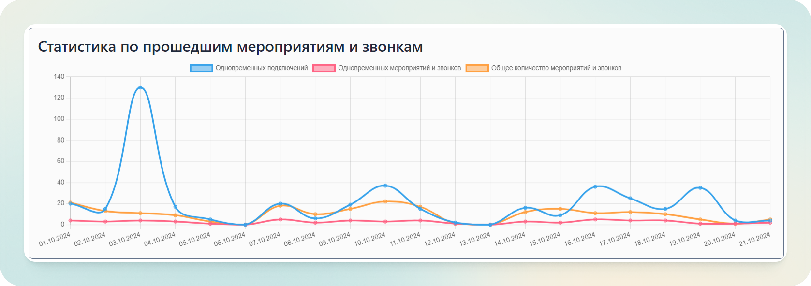

После графиков по всем форматам коммуникации доступен график по зарегистрированным пользователям, отражающий с каких устройств и типов клиента пользователи входят в личный кабинет Вкурсе.

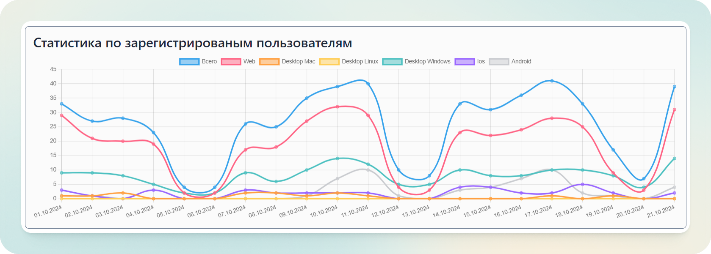

Статистика по мероприятиям позволяет увидеть кто, когда и какое мероприятие создавал. Если нажать на название колонки — данные отфильтруются по данному показателю.

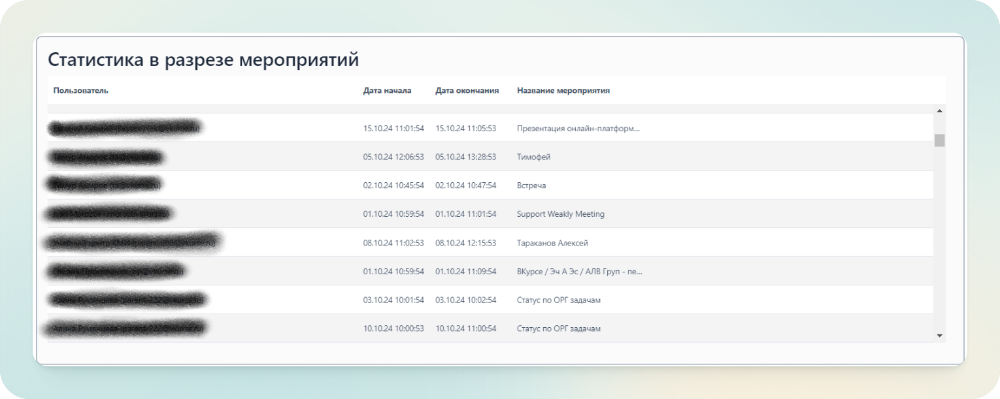

Планируемые мероприятия отображает количество мероприятий, которые планируются под каждым из пользователей (для понимания будущей нагрузки, активности использования платформы)

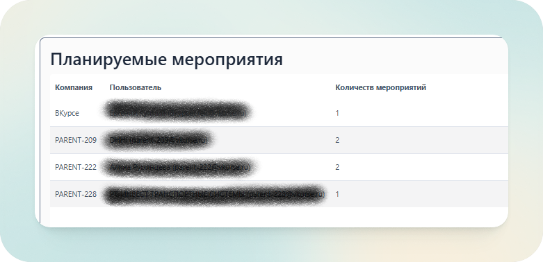

Использование диска отображает какой объем хранилища используется отдельными сотрудниками, чтобы понимание какие учетки самые загруженные. Удалить файлы для очисти диска может только сам организатор встреч и владелец данных.

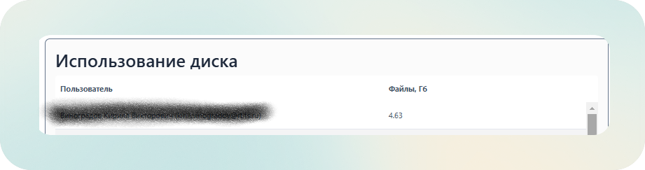

Общий объем используемого файлового хранилища отображается в начале страницы.
