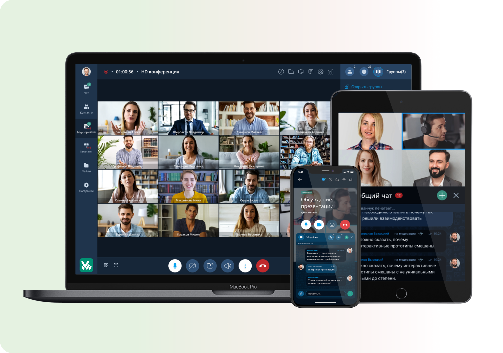

# Возможности платформы

ПРИЛОЖЕНИЕ «IVA CONNECT» - клиентское приложение
для внутрикорпоративных коммуникаций.

Работает в виде WEB-приложения для доступа в браузере, в виде мобильных приложений и десктоп приложений для PC и Macos.

Вход в приложение осуществляется с помощью учетных данных платформы ВКУРСЕ для пользователей корпоративного облака (SaaS) и полученных от администратора площадки частного облака (PaaS)

## Личный Кабинет Пользователя

Основная навигационная панель в Личном кабинете (ЛК) “Организатора” позволит:

- Общаться в ЧАТЕ (мессенджер)
- Планировать МЕРОПРИЯТИЯ
- Создавать КОМНАТЫ

## Формат Мероприятия

Организация Мероприятий и Комнат происходит на основе ==шаблона==, который содержит фиксированный набор функциональных настроек для каждой роли участников. Равноправное участие для шаблона Встреча или четкое разделение на докладчиков и участников в Вебинаре.

### Шаблоны Мероприятий

:::tip ВСТРЕЧА
Все участники видят и слышат друг друга
:::

:::tip ВЕБИНАР
Слушатели видят только докладчика и модератора и могут задавать вопросы
:::

:::tip ЛЕКЦИЯ
Рядовые участники видят только докладчиков и модераторов, но слышат всех и могут в любой момент включить звук (не камеру).
:::

:::tip СЕЛЕКТОР
Рядовые участники видят и слышат только докладчиков и модераторов (друг друга не слышат и не видят) и могут включать звук и камеру.
:::

Для любого шаблона также можно настроить Автозапись – автоматическое включение при старте мероприятия.

## ФОРМАТ КОМНАТА

ЭТО ПОСТОЯННОЕ АКТИВНОЕ МЕРОПРИЯТИЕ

Комната, как онлайн переговорная, доступна 24/7
Пользователь
не ограничен в количестве созданных комнат
Можно сохранять файлы и записи встреч для продолжительной совместной работы по общей ссылке

## ШАБЛОН: КОНФЕРЕНЦИЯ

СОЗДАНИЕ ОНЛАЙН МЕРОПРИЯТИЯ
НА ОСНОВЕ ШАБЛОНА «КОНФЕРЕНЦИЯ»

РАВНОПРАВНОЕ ОБЩЕНИЕ
среди участников

Все участники могут:

Видеть и слышать друг друга
Загружать файлы
Демонстрировать контент
Включать свою камеру и микрофон

функциональный блок
«ДОПОЛНИТЕЛЬНЫЕ НАСТРОЙКИ МЕРОПРИЯТИЯ»

поможет организатору провести мероприятие
в контролируемом режиме согласно задуманному сценарию

### ПРИГЛАШЕНИЕ КОЛЛЕГ В МЕРОПРИЯТИЕ

Зарегистрированный пользователь
в личном кабинете увидит приглашение

Индивидуальная ссылка придет пользователю на электронную почту.

### Подключение к мероприятию

Подключиться у мероприятию можно из личного кабинета иди же как гость по ссылке.
Рекомендуемые браузеры:

- Google Chrome
- Safari
- Яндекс.Браузер
- Microsoft Edge

Название мероприятия

В мероприятие можно войти заранее, только если при создания мероприятия был разрешен вход заранее (5, 10 или 15 минут)

Ваше имя подтягивается автоматически

Нажать для входа

НАСТРОЙКА ОБОРУДОВАНИЯ

:::warning Важно!
После перехода в мероприятие браузер может запросить доступ к камере и микрофону, нужно ==нажать "Разрешить"==.
:::
Выбрать нужное оборудование для звука
Если вы используете наушники с микрофоном, то можно нажать «Шумоподавление», чтобы убрать посторонний шум в помещении. Если вы без наушников, лучше не включать.

Выбрать камеру для вашего отображения. Если все работает корректно – вас будет видно на экране.
Выбрать качество трансляции. По умолчанию стоит высокое, но если во время мероприятия будут подвисания, можно вернуться в этот раздел и снизить качество до среднего.
После всех настроек нажать кнопку «Применить».

# Слайд 10

ПОЧЕМУ КАМЕРА И ЗВУК МОГУТ НЕ РАБОТАТЬ?

Если на ПК установлен антивирус Касперский или Доктор веб - могут быть недоступны устройства ввода вывода звука и видео.
Решение: Внести браузер google chrome или конкретно сайт платформы ВКС в доверенные в настройках Антивируса.

2. Если на ПК установлены другие ВКС приложения (мтс линк, zoom или иные) – при входе на Вкурсе могут быть недоступны устройства ввода вывода звука и видео, так как по умолчанию они подтягиваются в ранее используемые системы.
   Решение: полностью закрыть в операционной системе другие ВКС приложения, перезагрузить страницу мероприятия

# Слайд 11

Наименование мероприятия
Хронометр
Индикация записи

ИНТЕРФЕЙС УПРАВЛЕНИЯ МЕРОПРИЯТИЕМ/КОМНАТОЙ

Файлы
Белая доска
Опросы

Управление списком участников

Область трансляции

Настройки звука, качества

Чат и участники

Функционал модератора

## НИЖНЕЕ МЕНЮ НАСТРОЕК

Студенты могут ставить реакции во время мероприятий
Если микрофон перечеркнут – значит звук выключен, при активном микрофоне кнопка белого цвета и вас слышно студентам.
Кнопка камеры позволяет включить и отключить ваше изображение.
Демонстрация экрана. Подробнее об этих настройках на слайде 7.
Вызывет дополнительное меню.
Настройки оборудования (подробнее на слайде 3).
Изменить фон позволит сделать размытие или выбрать фон из предложенных вариантов.
ВАЖНО! Если вы начали мероприятие и затем нажали на красную кнопку и выбрали «Завершить мероприятие», то вернуться и возобновить мероприятие не получится.

1

2

3

4

7

5

8

Запись мероприятия и Стенограмма включаются и завершаются автоматически, но если нужно включить иди завершить вручную – это доступно в дополнительном меню п.5

6

## ЧАТ и УЧАСТНИКИ

У студентов есть возможность поднять руку, если в нижнем меню вызвать дополнительное меню
Чтобы видеть присутствующих студентов, в нижнем правом углу экрана можно вызвать список участников
Если студент поднял руку и хочет задавать вопрос – около имени участника появляется символ руки. Если нажать на Имя студента, то можно поменять ему роль (нажав на слово Докладчик). После этого студент сможет включить звук и голосом задать свой вопрос или ответить на вопрос преподавателя.
Студенты также могут задавать свои вопросы в чат.
Чтобы увидеть чат нужно нажать символ мессенджера в правом нижнем углу.

1

2

3

4

5

## ДЕМОНСТРАЦИЯ ЭКРАНА

Доступно 2 способа:

1. Если у вас файлы excel или презентация Power point c анимацией или видео, то рекомендуем демонстрировать экран. В нижнем меню нужно выбрать значок демонстрации экрана – «Начать демонстрацию» и нужный экран

2. Рекомендуемый способ, чтобы при демонстрации не показать ничего лишнего! Сохранить презентацию в формат pdf и загрузить в само мероприятие. Для этого в правом верхнем углу нужно нажать на символ Папки и после этого в левом углу нажать на Зеленый плюс и выбрать нужный файл с компьютера. После этого нажать на загруженный файл и выбрать «Начать демонстрацию»

1

2

## БЕЛАЯ ДОСКА

ДЛЯ СОВМЕСТНОЙ РАБОТЫ

ФУНКЦИОНАЛ БЕЛОЙ ДОСКИ ПОЗВОЛЯЕТ:

Сделать несколько слайдов для параллельной работы разными группами

Загрузить изображение
и работать поверх него

Добавлять фигуры и писать карандашом, создавая
блок схемы

Добавлять «стикеры» на доску

Для перехода на белую доску нужно в верхнем меню справа нажать на символ Доски. В правом углу также появится кнопка «Начать демонстрацию», нажав которую то что будет писать Преподаватель будет видно и студентам.

## ОПРОСЫ

Для перехода в раздел «Опросы» нужно в верхнем меню справа нажать на символ Опросы.
Важно! Для участия в опросах студентам также нужно будет перейти в тот же раздел

После перехода в раздел Опросы в середине экрана нужно нажать «создать опрос».
При создании Опроса нужно прописать сам вопрос, варианты ответа или свободный ответ (подробнее на слайде 10) и задать параметры (слайд 11).
При создании Опроса его можно внести несколько вопросов до начала лекции и нажать «Сохранить не начиная», в этом случае будет возможность начать опрос в нужное вам время.
Если создать опрос и нажать «Начать опрос» - студенты сразу смогут приступить к ответам.

1

2

4

3

## ОПРОСЫ (Тип ответа)

При создании Опроса сначала важно указать сам Текст вопроса.
Далее нужно выбрать «Тип ответа». Система предлагает несколько вариантов:
Свободный ввод: одна строка – позволяет указать в ответе свободный короткий текст.
Свободный ввод: абзац – аналогично предыдущему позволяет указать ответ в свободной форме, но более развернуто, несколькими предложениями.
Выбор нескольких вариантов – позволит выбрать несколько вариантов из указанных вами ответов.
Выбор одного варианта из нескольких – позволит выбрать только 1 вариант из указанных вами.

Даже если вы указали варианты ответов, есть возможность «добавить свободный ответ», чтобы студент мог предложить свой вариант ответа. 3. Чтобы создать еще один новый вопрос, нужно нажать
зеленый плюс в верхнем левом углу около слово Опросы.

1

2

3

## ОПРОСЫ (Параметры)

На платформе доступны следующие параметры для Опросов:
Анонимный опрос – в этом случае всем будут видны ответы, но ни студентам ни преподавателям не будет видно кто какой ответ.
Разрешить изменять уже данный ответ – до того как вы завершите опрос студенты смогут изменить свой ответ.
Показывать результаты только автору опроса и модераторам – В этом случае каждый из студентов будет видеть свой ответ, но ответы других участников им будут не видны. Вам же как создателю опроса можно будет нажать «Посмотреть детально» и увидеть как ответил каждый из участников. Если не выбрана ни эта функция, ни анонимный опрос – то такие результаты смогут увидеть все студенты.
Показывать промежуточные результаты – до завершения опроса уже будет видно кто из студентов как отвечает.

## ОПРОСЫ (Завершение и результаты)

Для завершения Опроса есть несколько возможностей:

1. Для завершения конкретного Опроса можно нажать на 3 вертикальные точки в левом верхнем углу данного вопроса – тогда появится возможность «Завершить» конкретный опрос.
2. Если вопросов было несколько – то сверху есть возможность «Завершить все» - после этого дать ответ на вопрос уже не получиться.
3. Важно! Результаты опроса можно выгрузить только до завершения мероприятия, поэтому если они необходимы, нужно в разделе опросы нажать на «Экспортировать результаты» и вам автоматически загpузиться excel файл с ответами.

1

2

3

Если вы создали несколько Опросов и «Сохранили не начиная», то чтобы в нужный момент начать Опрос – нужно нажать на 3 вертикальные точки как в п.1 и выбрать «Начать».

## Экспорт чата

Если участники писали сообщения в чат, которые вы хотели бы сохранить, то это можно сделать только до завершения мероприятия.

Для этого нужно открыть чат как было описано на слайде 5 и далее нажать на 3 вертикальные точки и выбрать «Экспорт чата». Файл автоматически выгрузиться к вам на компьютер.

---

это важный ==текст==

HTML и CSS — это ключевые технологии для создания веб-страниц.

_[HTML]: HyperText Markup Language
_[CSS]: Cascading Style Sheets
