# Возможности Лекции

## Как добавить файл во время проведения мероприятия

В данной статье вы научитесь загружать файлы во время проведения мероприятия на платформе ВКУРСЕ.

В нашем приложении вы можете легко добавлять файлы в хранилище во время мероприятия. Это позволяет моментально делиться с коллегами и участниками важным контентом и подготовленными материалами.

Давайте рассмотрим как добавить файлы во время проведения мероприятия.

**ШАГ 1:** На верхней панели управления мероприятием найдите кнопку “Файлы”

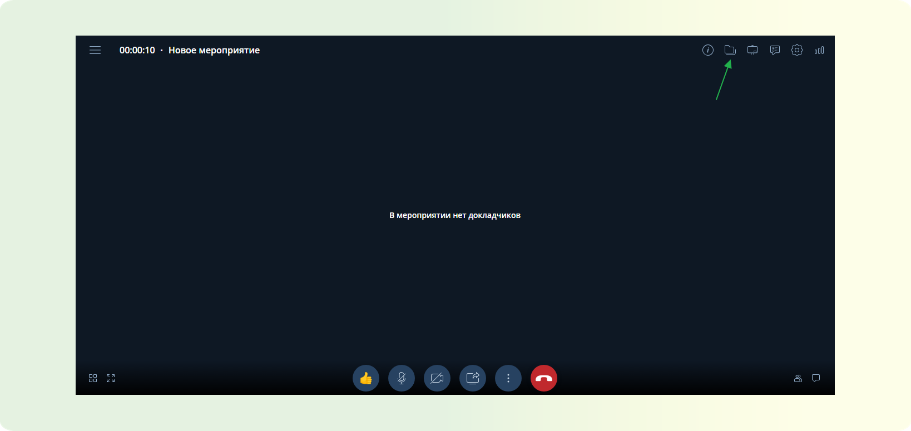

**ШАГ 2:** Нажмите на данную кнопку - Откроется хранилище файлов мероприятия, подробнее ознакомиться с функцией “Файлы” вы можете ознакомиться в данной статье.

**ШАГ 3:** Нажмите кнопку “Добавить файл или папку”(зеленый плюс) - В появившемся списке выберете “Загрузить файл” - Откроется окно операционной системы для выбора файла.

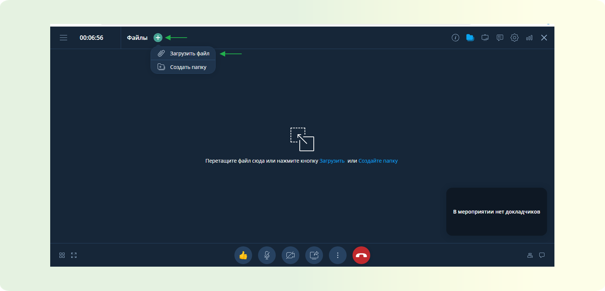

:::warning ВАЖНО
Для удобства на платформе ВКУРСЕ реализован функционал создания папок в хранилище мероприятия - он необходим для того, чтобы вам было удобно группировать те или иные файлы внутри мероприятия.

<!-- TODO:Подробнее ознакомиться с данной функцией можно в этой статье. -->

:::

**ШАГ 4:** Откройте необходимую папку в которой располагается ваш файл - Кликните на него - Нажмите кнопку “Открыть”

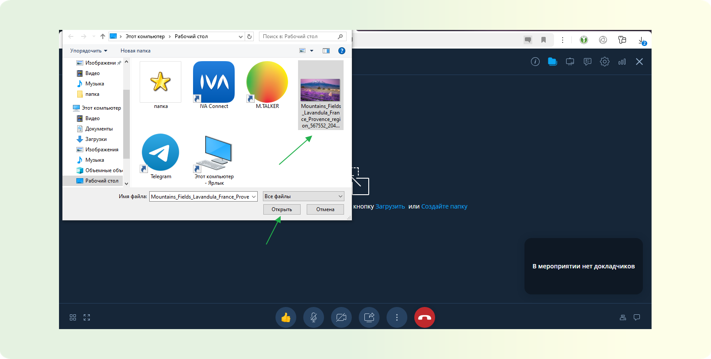

:::warning ВАЖНО
Платформа ВКУРСЕ поддерживает функцию “Drag and drop” - то есть вы можете захватить файл курсором мыши и перенести на загрузочную область необходимый файл.
:::

<!-- TODO:ВСТАВИТЬ КОНТЕНТ ГИФ -->

**ШАГ 5:** В зависимости от размера файла будет необходимо дождаться окончания конвертации. Если файл небольшой по размеру это проходит моментально. После чего можно демонстрировать данный файл для участников.

<!-- TODO:Подробнее ознакомиться с демонстрацией контента на платформе ВКУРСЕ можно в этой статье. -->

## Как добавить файлы при планировании мероприятия

В данной статье вы научитесь добавлять файлы при планировании мероприятия на платформе ВКУРСЕ.

В нашем приложении вы можете легко добавлять файлы в хранилище во время мероприятия. Это позволяет моментально делиться с коллегами и участниками важным контентом и подготовленными материалами.

Давайте рассмотрим как добавлять файлы при планировании мероприятия.

**ШАГ 1:** В функционале планирования мероприятия, подробнее ознакомиться с данной функцией можно в этой статье, выберете вкладку Файлы.

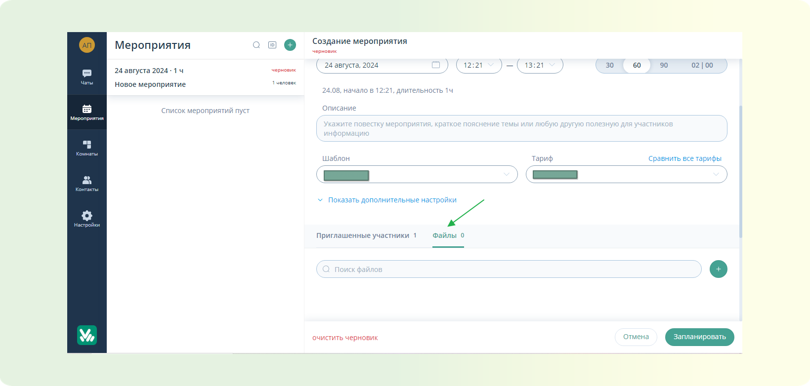

**ШАГ 2:** Нажмите на кнопку “Загрузить файл”(зеленый плюс) - Откроется окно операционной системы для выбора файла.

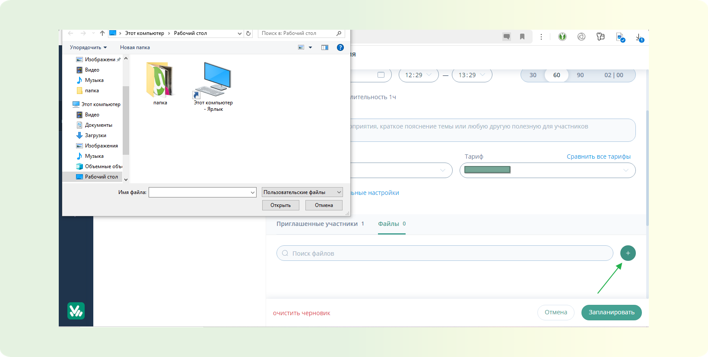

**ШАГ 3:** Откройте необходимую папку, в которой располагается ваш файл - Кликните на него - Нажмите кнопку “Открыть”

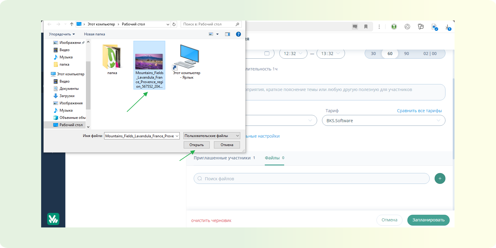

ВАЖНОЕ ПРИМЕЧАНИЕ: Платформа ВКУРСЕ поддерживает функцию “Drag and drop” - то есть вы можете захватить файл курсором мыши и перенести на загрузочную область необходимый файл.

<!-- TODO:ВСТАВИТЬ КОНТЕНТ ГИФ -->

**ШАГ 4:** В зависимости от размера файла будет необходимо дождаться окончания конвертации. Если файл небольшой по размеру, это проходит моментально. После чего можно демонстрировать данный файл для участников. Подробнее ознакомиться с демонстрацией контента на платформе ВКУРСЕ можно в этой статье.

<!-- TODO:СПИСОК ПОЛЕЗНЫХ СТАТЕЙ -->

## Как запустить демонстрацию загруженного файла

В данной статье вы научитесь, как запускать и демонстрировать загруженный в мероприятие файл.

Эта функция нужна для удобного показа презентаций на мероприятиях, позволяя загружать файлы, масштабировать контент и выделять важные моменты с помощью указки.

**ШАГ 1:** Запланируйте или запустите мероприятие в браузере. Подробней о планировании и запуске мероприятий вы можете узнать в этой [статье](/lekcii/prepare-web/).

**ШАГ 2:** Доступ к файлам

- В правом верхнем углу перейдите по кнопке "Файлы".

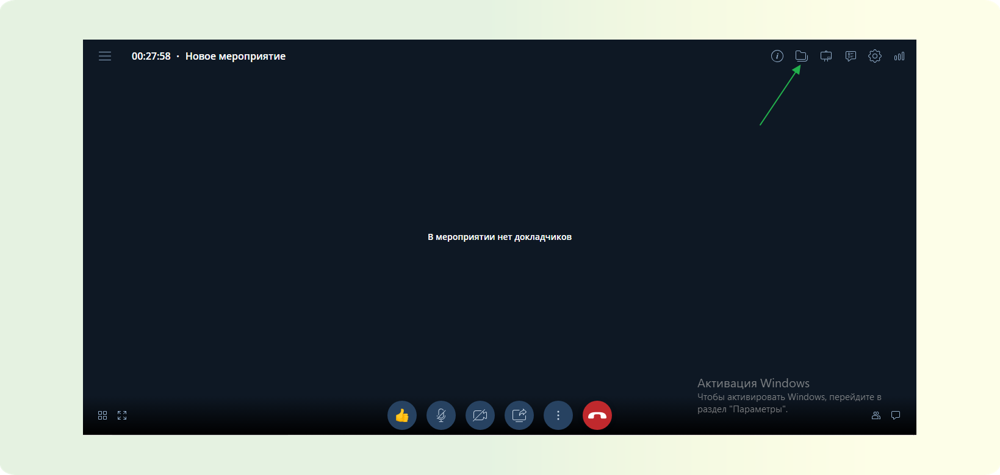

**ШАГ 3:** Загрузка файлов

- В открывшемся окне "перетащите" или "загрузите" необходимые файлы.
- Также можно добавить файлы через функционал "+" в левом верхнем углу окна.

<!-- TODO:ВСТАВИТЬ ГИФКУ -->

**ШАГ 4:** Ожидание конвертации

- Дождитесь завершения конвертации добавленного файла.

**ШАГ 5:** Начало демонстрации

- Нажмите на значок "Демонстрация дополнительного контента" внизу экрана, далее выберите вкладку "Файлы", кликаете на нужный, "Начать демонстрацию".

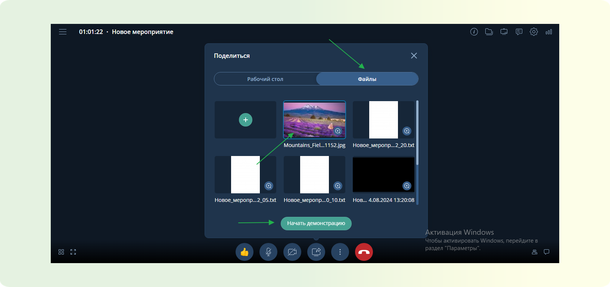

**ШАГ 6:** Масштабирование контента

- Используйте кнопки "плюс" и "минус", чтобы увеличить или уменьшить демонстрируемый контент.

<!-- TODO:ВСТАВИТЬ ГИФКУ -->

**ШАГ 7:** Подгонка по размеру экрана

- Для масштабирования контента до размеров экрана воспользуйтесь кнопкой "по размерам экрана".

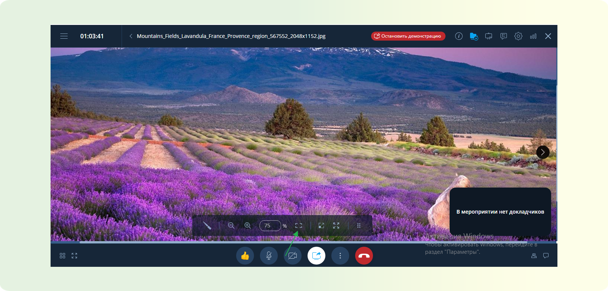

**ШАГ 8:** Использование указки

- Во время демонстрации можно воспользоваться инструментом "указка" для выделения важных моментов.

<!-- TODO:ВСТАВИТЬ ГИФКУ -->

## Как включить запись в мероприятии

В данной статье вы научитесь включать запись в мероприятии на платформе ВКУРСЕ.

В нашем приложении доступна функция записи мероприятия. Запись мероприятия открывает новые горизонты для вашего общения и совместной работы. Эта функция позволяет запечатлеть важные моменты в формате аудио и видео, что дает возможность участникам вернуться к ключевым обсуждениям и записям в любое удобное время. Благодаря записи, вы сможете легко делиться материалами с коллегами или участниками, которые не смогли присутствовать на лекции, обеспечивая таким образом полноценный доступ к информации и возможности для более глубокого анализа и обсуждения.

Давайте рассмотрим способ, как включать запись в мероприятии.

**ШАГ 1:** Перейдите в ранее созданное мероприятие. Подробнее ознакомиться с созданием мероприятий разных типов можно в этой статье.

**ШАГ 2:** На нижней панели управления найдите три вертикальные точки. В появившемся списке выберите кликните по пункту “Включить запись мероприятия”

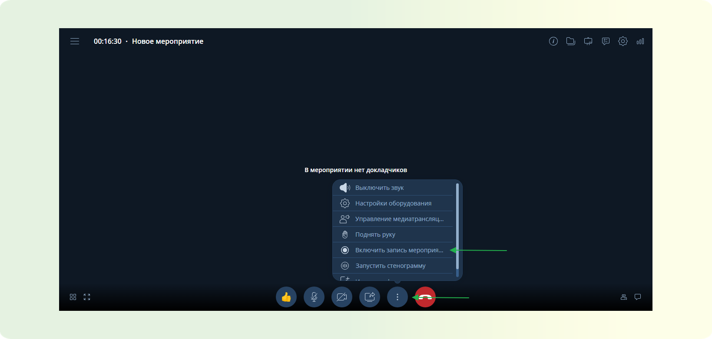

**ШАГ 3:** После включения записи в верхнем левом углу панели управления рядом с таймером появится красный кружок, это означает, что запись идет.

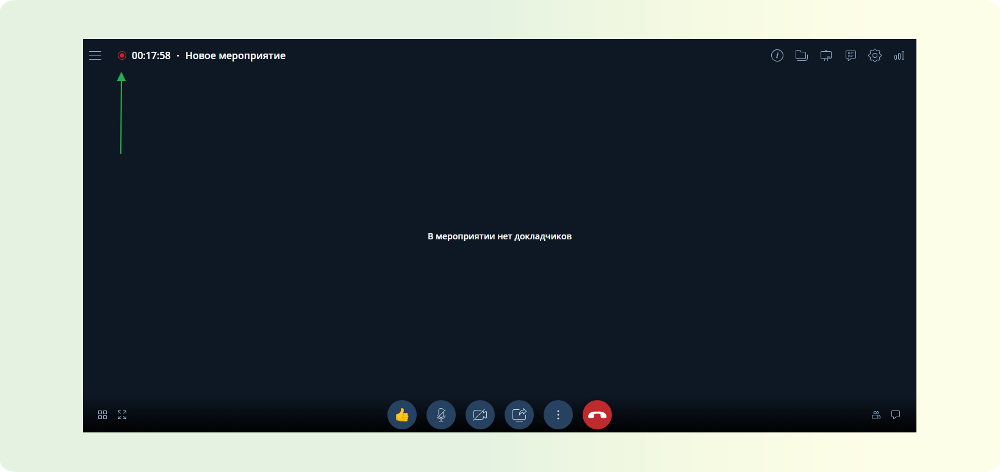

## Как выключить запись мероприятия и получить файл.

Выключить запись мероприятия возможно двумя способами.

### СПОСОБ 1: Автоматическое выключение записи мероприятия при завершении мероприятия.

:::warning ВАЖНО
Данный способ работает только в обычных мероприятиях. И только в том случае, если мероприятие завершено организатором / модератором. Подробнее ознакомиться с доступным функционалом для организатора / модератора можно в этой [статье](/lekcii/prava-uchastnikov/)
:::

**ШАГ 1:** На нижней панели управления. Найдите красную кнопку “Выйти из мероприятия”

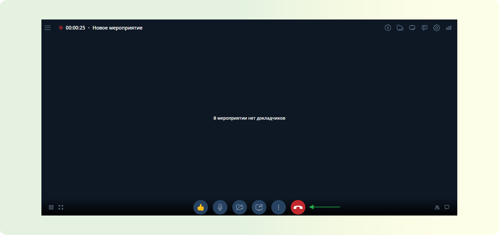

**ШАГ 2:** В появившемся списке кликните на “Завершить мероприятие”

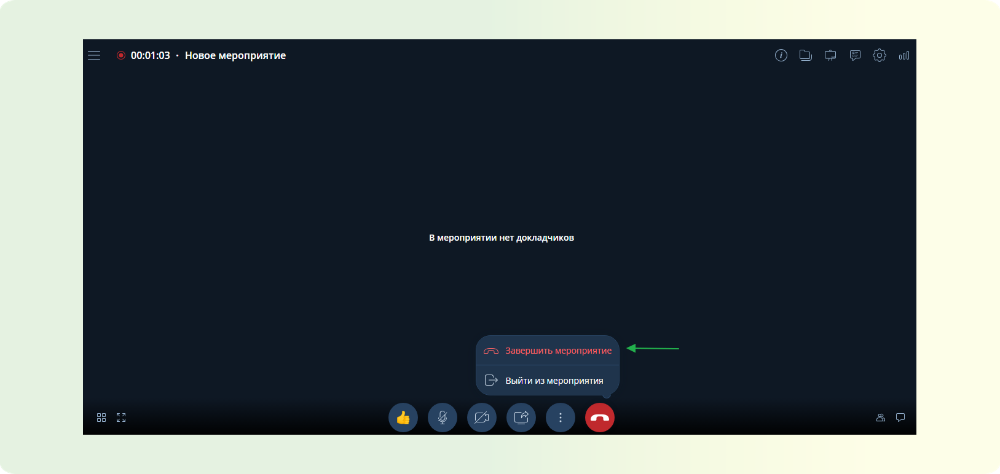

**ШАГ 3:** Мероприятие завершится, запись будет остановлена. Начнется автоматическая конвертация файла записи в формат `MP4`.

**ШАГ 4:** После окончания конвертации запись мероприятия окажется по следующему пути: пункт Мероприятия - Выберите необходимое мероприятие в ленте - кликните на него - кликните на вкладку “Файл” - Выберите необходимую запись - нажмите три точки напротив названия - скачайте или просмотрите запись.

<!-- TODO:ВСТАВИТЬ КОНТЕНТ ГИФ -->

## СПОСОБ 2: Ручное отключение записи файла.

:::warning ВАЖНО
Данный способ работает в любых мероприятиях. Ручное отключение записи мероприятия доступно только для организатора / модератора. Подробнее ознакомиться с доступным функционалом для организатора / модератора можно в этой [статье](/lekcii/prava-uchastnikov/)
:::

**ШАГ 1:** На нижней панели управления найдите три вертикальные точки. В появившемся списке кликните по пункту “Выключить запись мероприятия”

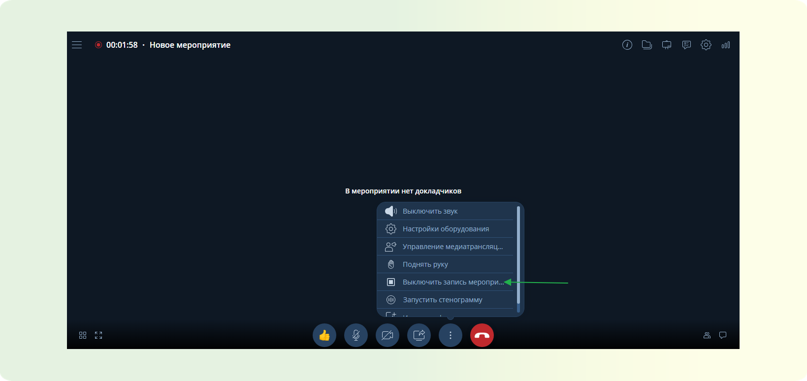

**ШАГ 2:** После выключения записи в верхнем левом углу панели управления рядом с таймером красный кружок исчезнет, это означает, что запись остановилась. Об этом сообщит соответствующее уведомление в нижнем левом углу.

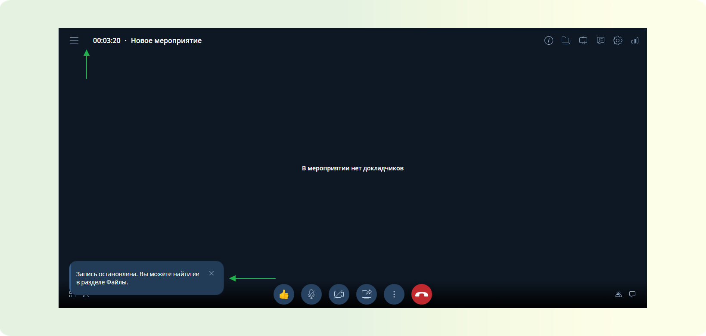

**ШАГ 3:** Дождитесь окончания конвертации записи.

<!-- TODO:ВСТАВИТЬ КОНТЕНТ картинка (будет ГИФ) -->

**ШАГ 4:** После окончания конвертации запись мероприятия окажется по следующему пути: в мероприятии перейдите в файловое хранилище, кнопка “Файлы” - Выберите необходимую запись - нажмите три точки напротив названия - скачайте или просмотрите запись.

<!-- TODO:ВСТАВИТЬ КОНТЕНТ ГИФ -->

# Как включить/выключить стенографирование в мероприятии

В данной статье вы научитесь включать стенографирование мероприятий на платформе ВКУРСЕ.

Наше приложение предлагает функцию стенографирования мероприятий, которая по сути является протоколированием лекции. Эта функция позволяет фиксировать важные моменты в текстовом формате, предоставляя возможность участникам вернуться к ключевым обсуждениям в любое время. Стенографирование упрощает обмен материалами с коллегами и теми, кто не смог присутствовать, обеспечивая доступ к важной информации и подробному анализу.

Давайте рассмотрим, как включать стенографирование в мероприятии.

**ШАГ 1:** Перейдите в ранее созданное мероприятие. Подробнее ознакомиться с созданием мероприятий разных типов можно в этой статье.

**ШАГ 2:** На нижней панели управления найдите три вертикальные точки. В появившемся списке выберите пункт “Запустить стенографирование”

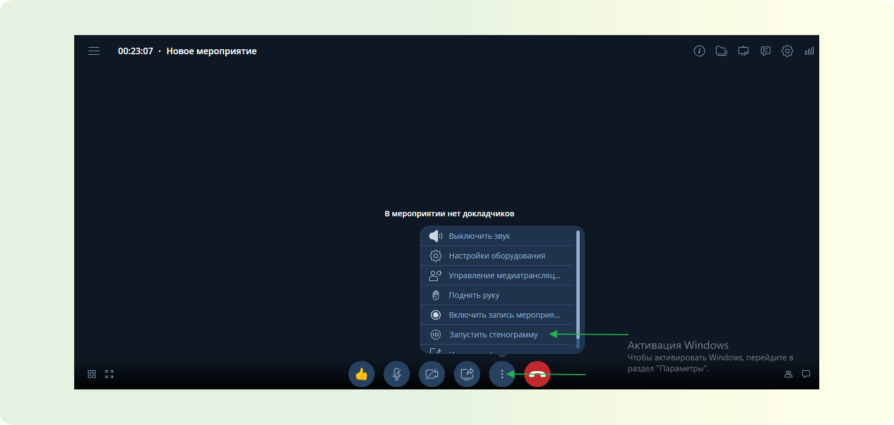

**ШАГ 3:** После включения стенографирования в верхнем левом углу панели управления рядом с таймером появится красный кружок, это означает, что стенографирование идет.

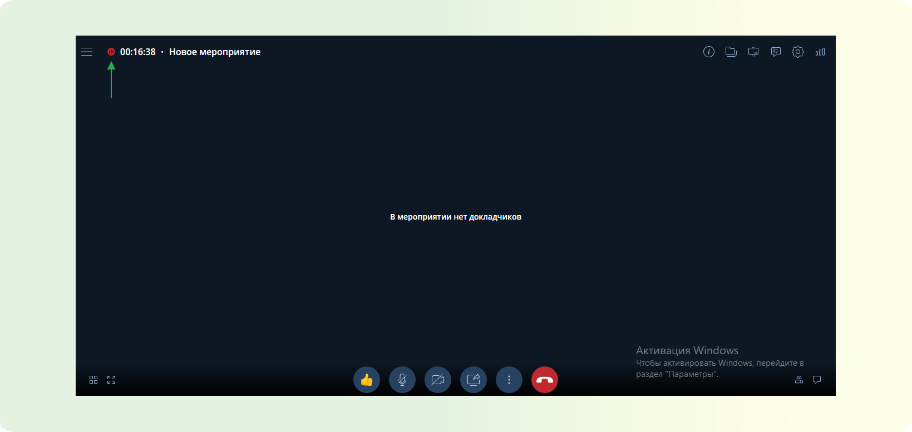

## Как выключить стенографирование мероприятия и получить файл.

Выключить стенографирование мероприятия возможно двумя способами.

### СПОСОБ 1: Автоматическое выключение стенографирования мероприятия при завершении мероприятия.

:::warning ВАЖНО
Данный способ работает только в обычных мероприятиях. И только в том случае, если мероприятие завершено организатором / модератором. Подробнее ознакомиться с доступным функционалом для организатора / модератора можно в этой [статье](/lekcii/prava-uchastnikov/).
:::

**ШАГ 1:** На нижней панели управления найдите красную кнопку “Выйти из мероприятия.”
**ШАГ 2:** В появившемся списке кликните на “Завершить мероприятие.”

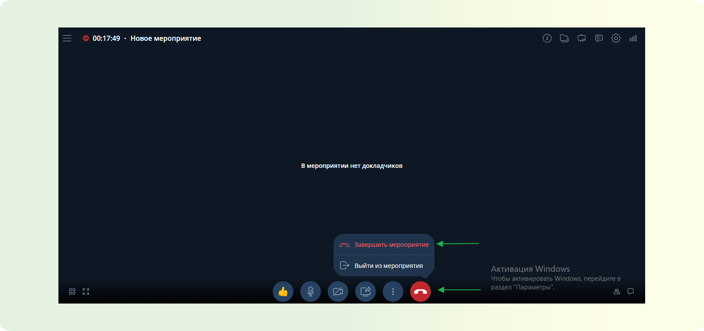

**ШАГ 3:** Мероприятие завершится, стенографирование будет остановлено. Начнется автоматическая конвертация файла стенографирования в формат текстового документа.

<!-- TODO:ВСТАВИТЬ КОНТЕНТ картинка (будет ГИФ) -->

**ШАГ 4:** После окончания конвертации стенографирование мероприятия окажется по следующему пути: пункт Мероприятия - выберите необходимое мероприятие в ленте - кликните на него - кликните на вкладку “Файл” - выберите необходимый документ- нажмите три точки напротив названия - скачайте или посмотрите.

<!-- TODO:ВСТАВИТЬ КОНТЕНТ картинка (будет ГИФ) -->

### СПОСОБ 2: Ручное отключение стенографирования мероприятия.

:::warning ВАЖНО
Данный способ работает в любых мероприятиях. Ручное отключение стенографирования мероприятия доступно только для организатора / модератора. Подробнее ознакомиться с доступным функционалом для организатора / модератора можно в этой [статье](/lekcii/prava-uchastnikov/).
:::

**ШАГ 1:** На нижней панели управления найдите три вертикальные точки. В появившемся списке кликните по пункту “Выключить стенографирование”.

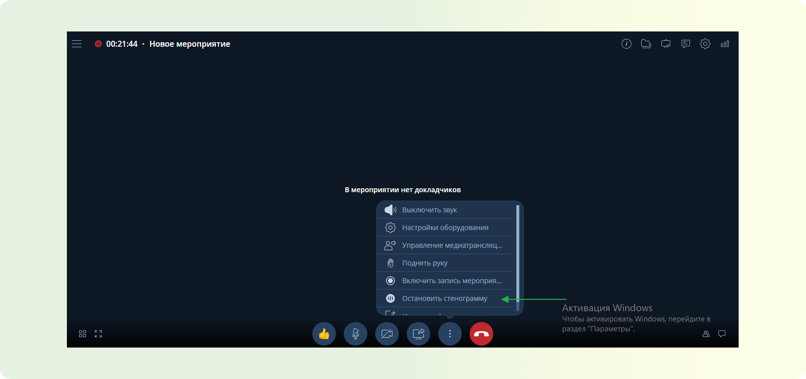

**ШАГ 2:** После выключения стенографирования в верхнем левом углу панели управления рядом с таймером красный кружок исчезнет, это означает, что стенографирование остановилось. Об этом сообщит соответствующее уведомление в нижнем левом углу.

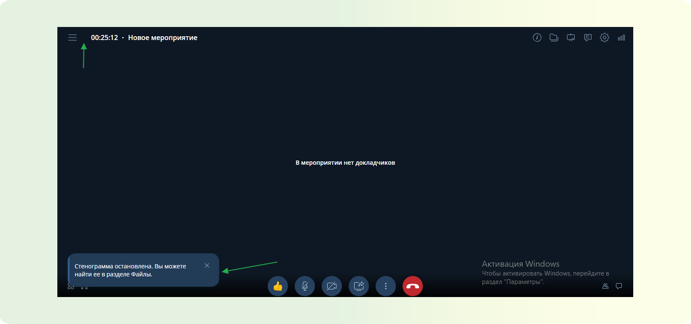

**ШАГ 3:** Дождитесь окончания конвертации стенографирования.

**ШАГ 4:** После окончания конвертации стенографирование мероприятия окажется по следующему пути: в мероприятии перейдите в файловое хранилище, кнопка “Файлы” - выберите необходимую запись - нажмите три точки напротив названия - скачайте или просмотрите запись.

<!-- TODO:ВСТАВИТЬ КОНТЕНТ картинка (будет ГИФ) -->
