# Список нового функционала платформы за Август 2024

:::tip Содержание
[[toc]]
:::

## Генерация пароля мероприятия

Пароль мероприятия - это дополнительная защита мероприятия от посторонних.
Теперь при создании, в дополнительных настройках мероприятия и при приглашении в мероприятие по ссылке вы можете автоматически сгенерировать пароль мероприятия.
На скриншотах ниже указаны действия для использования данной функции:

Перейдите во вкладку Мероприятия в личном кабинете на платформе ВКурсе.

Нажмите на кнопку "Добавить"

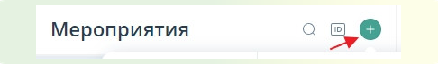

Выберете "Запланировать" или один из шаблонов мероприятий "Начать сейчас"

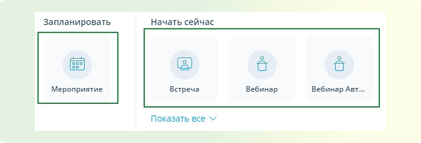

1\. Если вы выбрали запланировать у вас откроется функционал создания мероприятий, для того чтобы сгенерировать пароль, нажмите кнопку "Показать дополнительные настройки"

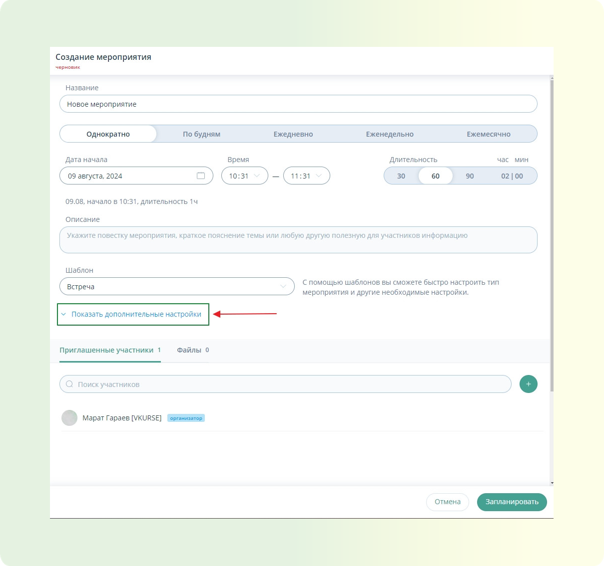

- Раскроется список дополнительных настроек. В данном списке поставьте галочку на пункте "Запрашивать пароль для неприглашенных участников". По умолчанию будет задан случайный пароль для рядовых гостей и докладчиков, его вы можете просмотреть и скопировать при помощи функции "Показать пароль". При помощи функции "Обновить" пароль можно перегенерировать.

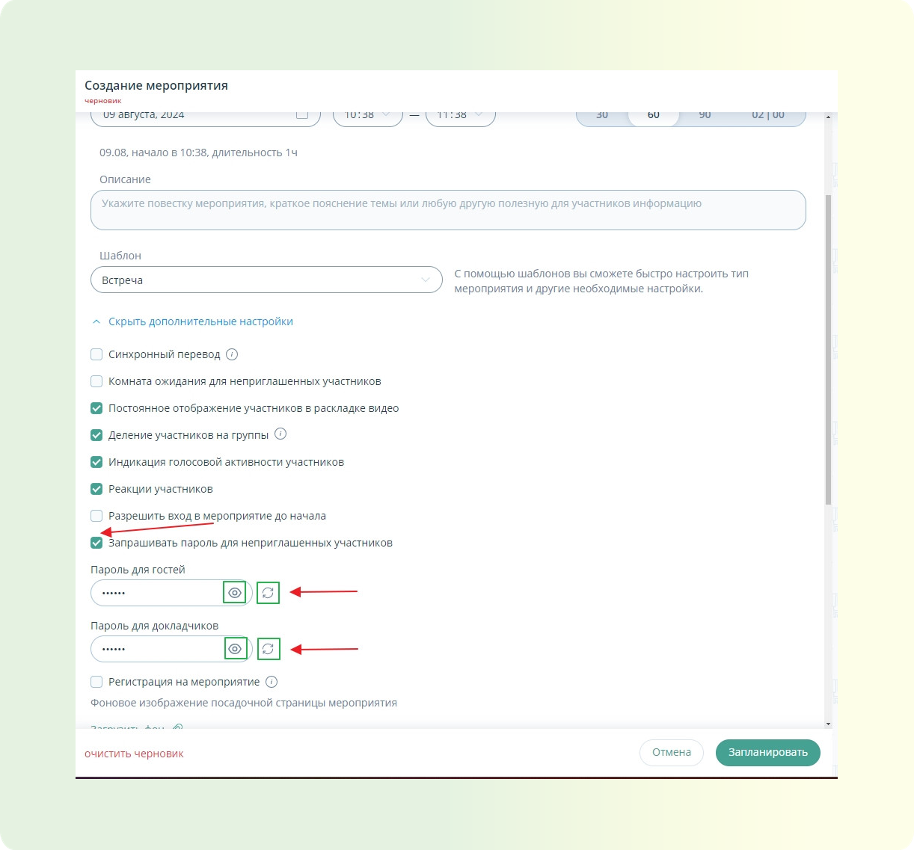

- После нажатия на кнопку "Запланировать" будет создано мероприятие с паролем для участников подключающихся по гостевой ссылке или гостевой ссылке докладчика. Так же у вас будет возможность перегененрировать пароль внутри мероприятия, инструкция в пункте 2.

2. Если вы выбрали шаблон мероприятия при помощи функции "Начать сейчас" мероприятие запустится сразу и вы попадете внутрь. Для доступа к генерации пароля воспользуйтесь функцией "Настройки" внутри мероприятия.

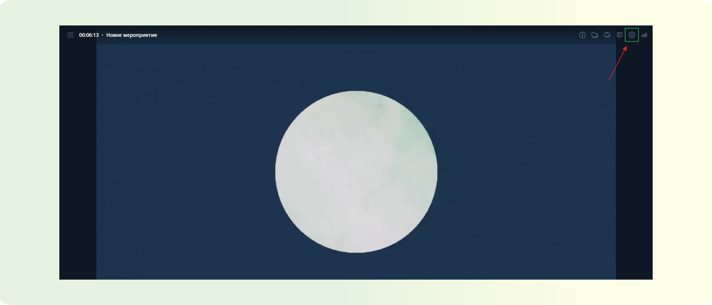

- После открытия функционала настроек мероприятий нажмите на пункт "Расширенные настройки ссылок".

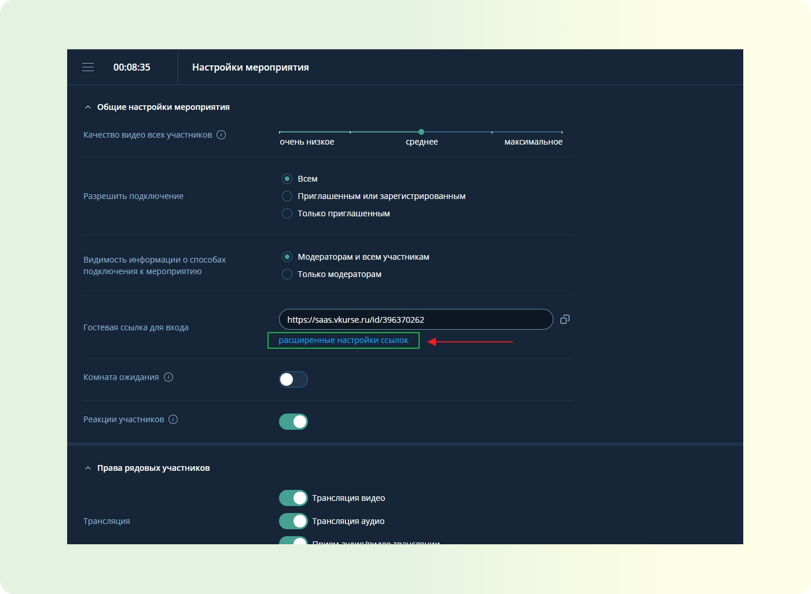

- Откроется окно расширенных настроек ссылок.

В данном окне вы увидите пункт "Вход для гостей". В пункте указана гостевая ссылка для подключения и пароль для гостей. Пароль вы можете перегенерироватьт при помощи функции обновить, либо задать его вручную, а так же скопировать и просмотреть.

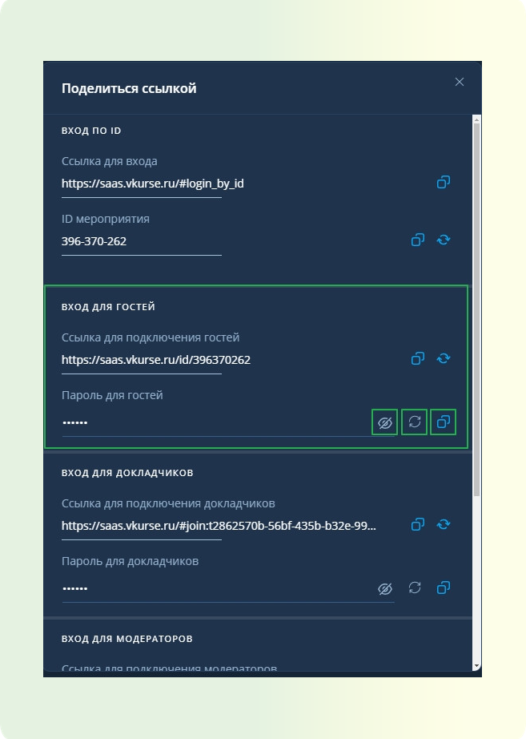

## Мягкий мьют участников мероприятия

Мы расширили права организатора и добавили мягкий мьют участников мероприятия. Это означает следующее:

- Модератор (человек, который управляет мероприятием) может:
  - Выключить микрофон или камеру участника
  - Попросить участника включить камеру или микрофон

Когда модератор делает это, участник увидит специальное уведомление на своем экране. Это позволяет ему понять, что его микрофон или камера были отключены.

• Модератор также может принудительно включать камеру или микрофон участника, даже если тот их выключил.

## Шумоподавление в звонках и мероприятиях

Добавлена новая опция "Шумоподавление". Она помогает убрать лишние звуки, когда вы участвуете в звонках или мероприятиях.

Вот как это работает:

• Когда включаете эту опцию, платформа будет фильтровать и убирать посторонние шумы, которые могут быть слышны во время вашего участия в звонке или мероприятии.

Это помогает сделать звук более чистым и четким, чтобы другим участникам было легче вас слышать.

• Найти опцию "Шумоподавление" можно в настройках профиля пользователя и в настройках звонка / мероприятия.

**Настройка профиля пользователя**

**Настройка звонка / мероприятия**

## Экспорт истории чата в мероприятии

Добавлена возможность экспорта истории чата мероприятия / комнаты. Эта функция очень полезна, если вам нужно сохранить важные сообщения или информацию, которая была написана в чате во время мероприятия или разговора. Сделать экспорт может пользователь с ролью администратор в окне чата.

## Доработка UX дозвона до VVoIP-участника

**Добавлена поддержка совершения вызова пользователя в мероприятие
по номеру телефона / адресу VVoIP-устройства через панель набора
номера**

1. Войдите в мероприятие через личный кабинет. Нажмите + в панели участников.

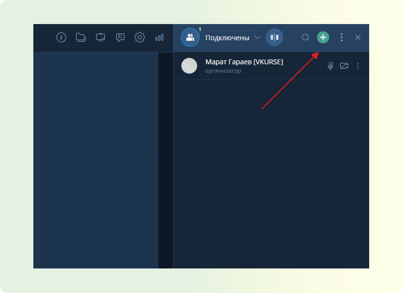

2\. Нажмите на кнопку "Позвонить".

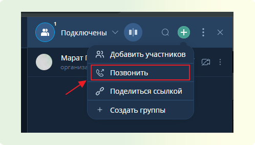

3\. Раскроется панель набора номера в котором вы можете набрать номер телефона или адрес VVoIP устройства.

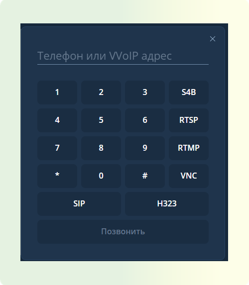

4. После набора номера или адреса VVoIP устройства, даже если произойдет сброс со стороны участника, он останется в списке неподключенных, от куда его можно вызвать повторно.
**Данные пользователи отображаются в списке участников мероприятия**
**в отдельном окне:**

1. Нажать на кнопку вызова

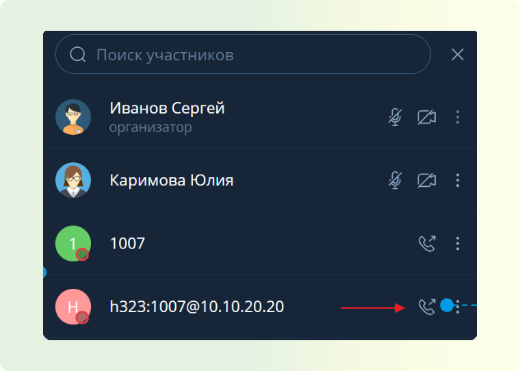

2\. Начнется вызов VVoIP участника в мероприятие. Если необходимо вызов можно сбросить.

## Подключение в мероприятие без интернета

Если вы находитесь там где нет доступа к интернету либо вам не удобно подключаться в мероприятие вы может звонить в мероприятие по номеру телефона и/или VVoIP устройства.
Для этого необходимо запросить у организатора мероприятия номер телефона мероприятия и ID
Далее вы набираете номер телефона на вашем устройстве нажимаете кнопку "Вызов" вводите ID мероприятия и нажимаете #(решетку) . Происходит подключение к мероприятию, и вы можете полноценно в аудиоформате в нем участвовать.

## Бронирование ресурсов подписки

Бронирование ресурсов подписки - Реализована возможность бронирования подключений при
планировании и редактировании мероприятий. Это необходимо чтобы ограничить количество используемых ресурсов тарифа пользователями компании.

Для использования данной функции во вкладке "Мероприятия" перейдите в планирование:

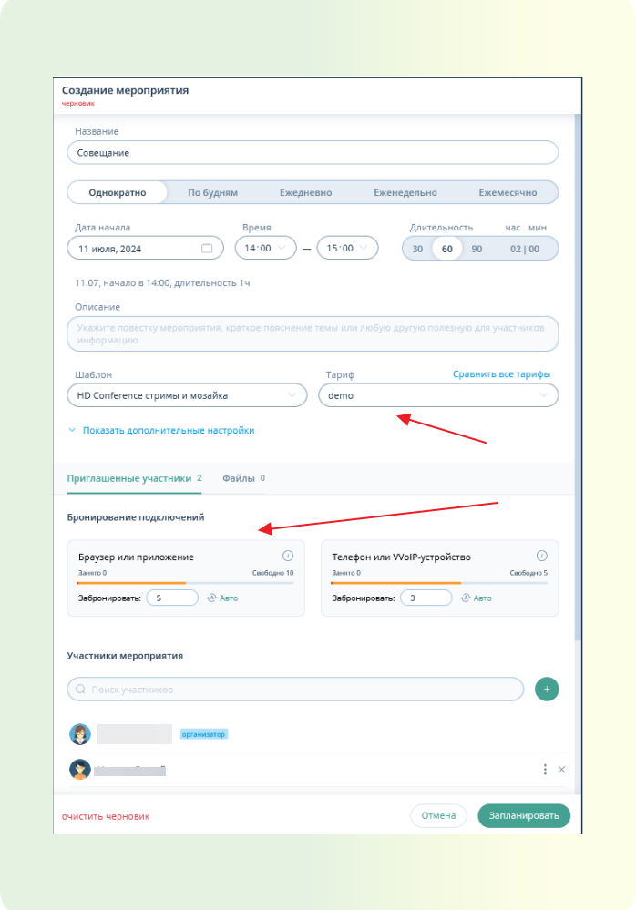

Для осуществления бронирования необходима подписка с соответствующей настройкой и хотя бы один доступный тип бронирования WebRTC / VVoIP

Если количество забронированных подключений превышает количество свободных подключений, то будет написано предупреждение Превышено количество свободных подключений, а кнопка Запланировать станет неактивной.

Чтобы сбросить количество забронированных подключений, необходимо: Нажать кнопку Авто.
