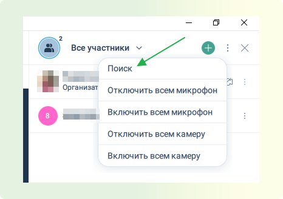

# Список нового функционала платформы Сентябрь 2024

:::tip Содержание
[[toc]]
:::

## Добавление пользователя в контакты из его профиля

Реализована возможность добавления пользователя в контакты из его профиля.

Для этого перейдите в профиль пользователя и нажмите кнопку "добавить в контакты".

## Поддержка многоэкранного режима

Реализована поддержка многоэкранного режима работы приложения **–** добавлена возможность управления выводом основного и дополнительного контента на различные устройства и переключения между режимами отображения в активных мероприятиях и звонках.\*\*

1. Подключаетесь к нужному мероприятию во вкладке "Мероприятия".

2. Запустите демонстрацию экрана и выберите нужный тип режима отображения внизу экрана.

:::warning ВАЖНО
чтобы кнопка отображалась на экране, у вас должен быть подключен дополнительный монитор(ы).
:::

## Демонстрация рабочего стола со звуком

Добавлена возможность управления звуком активной трансляции мероприятия / комнаты через настройку "Демонстрировать со звуком" (вкл. / выкл.) без ее прерывания.

1. Подключаетесь к нужному мероприятию во вкладке "Мероприятия".

2. Выбираете в нижней панели управления мероприятием значок "Демонстрация"

3. После выбора нужного экрана вам будет доступна функция демонстрации со звуком.

## Поддержка ручных статусов

Вы теперь можете установить или сбросить ручной статус (подписи к статусу) в настройках собственного профиля. Статус будет отображаться в чатах и в профиле.\*\*

1. Нажимаете на иконку профиля в верхнем левом углу экрана. Затем выбираете "Пользовательский статус"

2. Далее вам будет доступно поле для ввода своего собственного статуса или выбора из шаблонных вариантов. Чтобы он применился, нажмите кнопку "Сохранить" после заполнения поля для свободного ввода статуса или выбора шаблонного. Для сброса статуса нужно нажать на кнопку "Сбросить".

## Возможность изменения ссылок на мероприятие

Добавлена возможность изменения модератором ID и ссылок гостевых/для докладчиков/для модераторов, а также ввода/автоматической генерации пароля для гостевого входа/для докладчиков в активном мероприятии. При смене ID или ссылки мероприятия отображается предупреждение о недействительности прежних ID или ссылки.

1. В мероприятии выбираете значок "Настройки" в правом верхнем углу. Затем выберите "Расширенные настройки ссылок".

2. После вам будет доступно изменение ссылок/ID мероприятия/паролей для подключения к мероприятию.

3. Перед изменением вы увидите уведомление о том, что текущие ссылки/ID мероприятия/пароль станут неактуальны, чтобы изменить ссылку/ID мероприятия/пароль, нажмите "Изменить".

## Удаление всех сообщений в чате мероприятия

Теперь модератор имеет возможность очистки истории чата в мероприятиях и комнатах.\*\*

1. В мероприятии откройте чат в нижней правой части экрана.

2. Далее нажмите на три вертикальных точки в верхнем правом углу **→ "**Очистить чаты".

3. После нажатия на кнопку "Очистить чаты" вы увидите окно, которое предупреждает об удалении всех чатов, для подтверждения действия нажмите "Очистить".

## Звонки из комнат и мероприятий

Теперь вы можете звонить прямо из комнат и мероприятий не подключившимся контактам.\*\*

1. В мероприятии/комнате выбираете вкладку "Участники" в нижнем правом углу экрана. Затем в верхнем правом углу выбираете "Все участники" и проваливаетесь в нужного вам.

2. После того, как выбрали нужного участника, нажимаете кнопку "Вызвать".

## Поиск пользователей в мероприятии

Теперь вы можете искать пользователей в списке участников активного мероприятия.\*\*

1. В мероприятии нажмите на кнопку "Участники", которая располагается внизу справа. Затем нажмите на три вертикальных точки справа вверху.

2. Выберите из появившегося списка "Поиск".

3. Далее вам откроется поле, в котором вы можете вводить данные участника, чтобы его найти.

