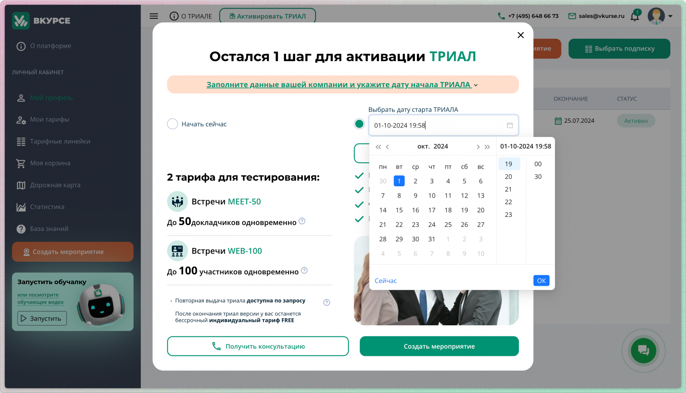

# Как эффективно использовать пробный период для коммерческого тарифа

Пробный период для коммерческого тарифа предоставляет пользователю возможность протестировать все основные функции платформы без ограничений и оценить, как они соответствуют бизнес-потребностям.

Для проведения теста предоставляются сразу 2 тарифа платформы для проведения встреч (MEET-50) и для организации вебинаров (WEB-100).

## Условия предоставления

Длительность пробного периода составляет 5 дней, для активации активации достаточно иметь подтвержденный рабочий email и номер телефона и выбрать дату активации пробного периода.

## Основные возможности тарифов:

Во время тестового периода вы можете без ограничений организовывать встречи до 50 человек в роли докладчик а так же приглашать до 100 участников для проведения вебинаров.

## Рекомендации для пробного периода

Что бы сделать ваш опыт пользования более комфортным, рекомендуем обратить внимание на следующие моменты

### Определитесь с целями тестового периода

Платформа ВКУРСЕ идеально подходит для ежедневных встреч внутри организаций, взаимодействия с партнерами, регулярных конференций и проведения внутреннего и внешнего обучения.<svg class="svg-icon right-triangle" fill="none" height="24" stroke="currentColor" stroke-linecap="round" stroke-linejoin="round" stroke-width="2" viewbox="0 0 24 24" width="24" xmlns="http://www.w3.org/2000/svg"></svg>

### Выберите удобное время для активации пробного периода

Одним из удобных преимуществ является возможность выбрать оптимальный момент для активации пробного периода. Вы можете начать тестирование тогда, когда это будет максимально удобно для вашей команды и совпадет с планами по запуску проектов или встреч. Это позволит получить максимальную выгоду от использования всех функций без временных ограничений.

]

### Изучите ключевые функции платформы

Используйте пробный период, чтобы полностью изучить возможности коммерческого тарифа:

- **Групповые конференции**: Проведите встречи с коллегами, чтобы понять, как работает видеосвязь с использованием приложений для десктопа и мобильных а так же в браузере.
- **Опросы и белая доска**: Опробуйте функции взаимодействия с участниками конференций — проводите опросы, brainstorm с помощью интерактивной доски.
- **Демонстрация экрана**: Оцените, насколько удобно показывать презентации, документы и другие материалы во время встреч.
- **Файловое хранилище**: Попробуйте загружать и делиться файлами с другими участниками. Записывайте ваши мероприятия.

### Привлеките коллег для тестирования

Максимально эффективно тестировать платформу можно при участии нескольких пользователей. Пригласите свою команду или коллег для проведения совместных мероприятий. Это поможет вам понять, насколько удобна платформа для коллективной работы и как она справляется с реальными задачами.

### Проверьте работу поддержки клиентов

Во время пробного периода доступна поддержка 9x5 и 24x7 по каналам горячей линии (телефон), email и в мессенджерах.

Воспользуйтесь поддержкой, чтобы узнать, насколько оперативно и профессионально решаются вопросы и оказывается помощь в проведении ваших мероприятий.

### Планируйте переход на коммерческий тариф

В конце пробного периода оцените результаты:

- Сравните ваши ожидания с тем, что удалось протестировать.
- Обсудите с командой, удовлетворены ли они возможностями платформы.
- Если вы видите потенциал для вашего бизнеса, оформите подписку на коммерческий тариф до окончания пробного периода, чтобы избежать перерыва в использовании платформы.

## Окончание пробного периода

По истечении пробного периода ваш аккаунт переводится на тариф FREE.
