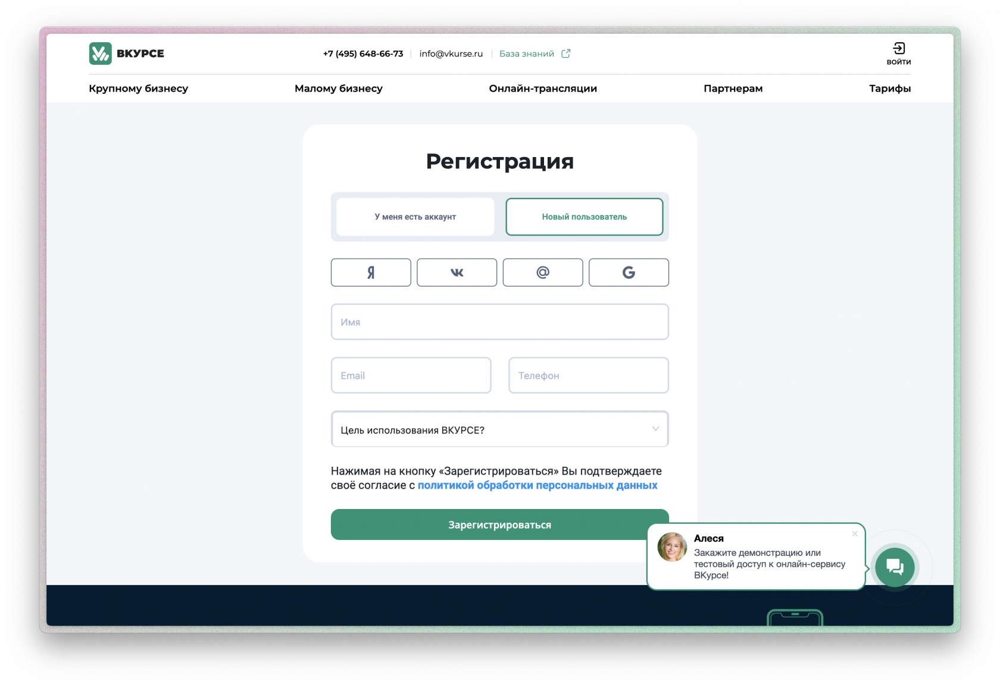
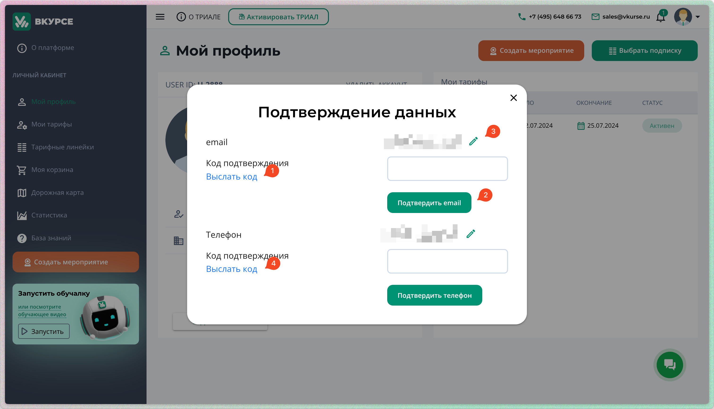

# Как подключиться к платформе ВКУРСЕ

### Регистрация

Для того чтобы начать пользоваться платформой, выполните следующие шаги:

#### Регистрация по email и телефону:

На странице [https://vkurse.ru/signup](https://vkurse.ru/signup)

— Укажите ваш действующий адрес электронной почты и номер телефона.

- После завершения регистрации, вам будет отправлен пароль на указанные email и телефон.
- В дальнейшем для входа в систему вы можете использовать любой из этих идентификаторов (email или телефон).

#### Регистрация через социальные сети:

Вы можете зарегистрироваться с помощью учетной записи Яндекс, Google, Mail.Ru или ВКонтакте.Выберите одну из опций на странице регистрации и выполните авторизацию через ваш аккаунт в выбранной соцсети. Это просто и безопасно.

#### Переход в личный кабинет

После успешной регистрации и авторизации на платформе, вы будете перенаправлены в ваш личный кабинет. В личном кабинете вы сможете управлять своими настройками, тарифами, создавать мероприятия и отслеживать их статус.

### Тариф FREE

После входа на платформу, вам автоматически будет предоставлен тариф **FREE** на три дня. Этот тариф включает следующие возможности:

- Неограниченная продолжительность и количество мероприятий.
- Групповые конференции.
- Опросы и использование виртуальной белой доски.
- Возможность демонстрации экрана и обмена файлами.
- Хранение файлов в облачном хранилище.

### Подтверждение персональных данных

По окончании трехдневного периода, если вы не подтвердите ваши данные (email и телефон) вам будут ограничены возможности использования тариф FREE.
Что бы подтвердить данные:

1. В личном кабинете нажмите на Подтвердить личные данные. В открывшемся окне:
1. Нажмите ссылку Выслать код (1) на почту и на номер телефона (4).
1. Дождитесь сообщения и укажите уникальный код в поле подтверждения (2) и подтвердите кнопкой
1. 3. В случае если у вас нет доступа к почте, телефону или вы долго не можете получить сообщение — то вы можете изменить email/номер (3)

