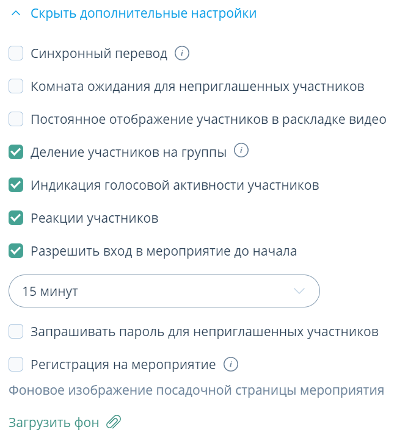
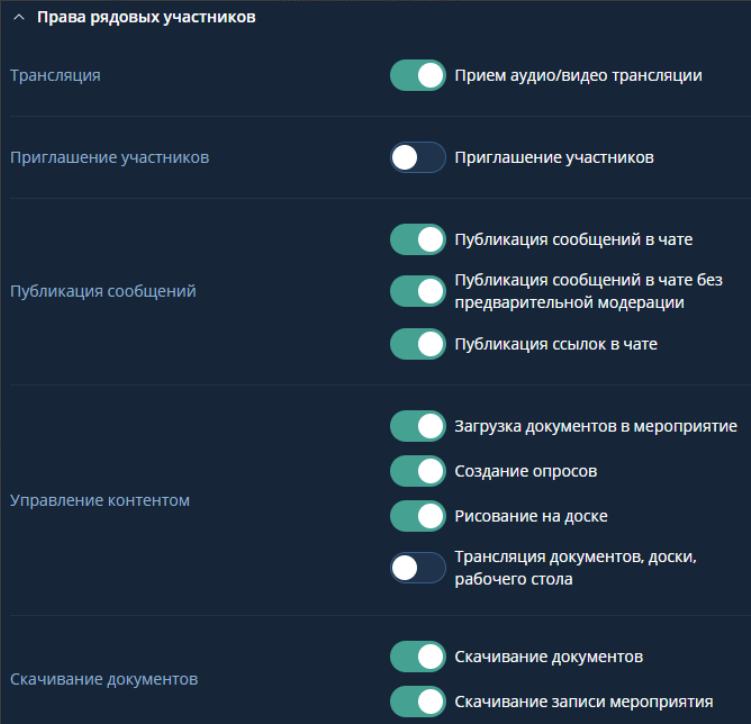

# Настройки вебинара

## Модерация в мероприятии Вебинар (Браузер)

**Вебинар** - Слушатели видят только докладчика и модератора и могут задавать вопросы.

При планировании мероприятия Вебинар по умолчанию выставлены ключевые разрешения:

- Деление участников на группы (позволяет распределять участников мероприятия по группам)
- Индикация голосовой активности участников
- Реакции участников
- Разрешить вход в мероприятие до начала

В режиме мероприятия в блоках управления участниками выданы не все разрешения:

Трансляция:

- Трансляция видео
- Трансляция аудио
- Прием аудио/видео трансляции

Приглашение участников:

- Приглашение участников

Публикация сообщений:

- Публикация сообщений в чате
- Публикация сообщений в чате без предварительной модерации
- Публикация ссылок в чате

Управление контентом:

- Загрузка документов в мероприятие
- Создание опросов
- Рисование на доске
- Трансляция документов, доски, рабочего стола

Ск ачивание документов:

- Скачивание документов
- Скачивание записи мероприятия

