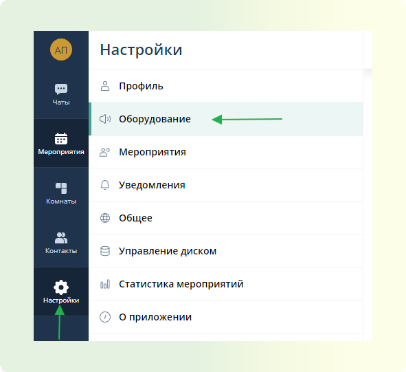

# Как настроить оборудование камеру, микрофон, динамик

В данной статье вы научитесь настраивать оборудование для участия в мероприятиях на платформе ВКУРСЕ.

На нашей платформе вы можете настроить камеру и микрофон как перед началом мероприятия, так и во время него. Это позволяет быстро адаптировать оборудование для комфортного участия и при необходимости легко внести изменения.

Настроить оборудование можно двумя способами. Давайте рассмотрим оба способа.

## СПОСОБ 1: Настройка оборудования в личном кабинете.

**ШАГ 1:** В личном кабинете, на боковой панели, перейдите во вкладку “Настройки” - Кликните на пункт “Оборудование”

[

**ШАГ 2:** В открывшемся функционале настройки оборудования выберете подключенный микрофон, камеру. Если необходимо, включите шумоподавление, отрегулируйте чувствительность микрофона, громкость звука или включите фон для камеры.

[

:::warning ВАЖНО
Любые изменения в настройках оборудования на платформе ВКУРСЕ сохраняются автоматически.
:::

**ШАГ 4:** Настройка завершена. При дальнейшем участии в мероприятиях будут применяться ваши настройки.

## СПОСОБ 2: Настройка оборудования при входе в мероприятие или во время проведения.

:::warning ВАЖНО
При входе в мероприятие, если у вас в настройках оборудования включен пункт “Показывать окно настроек при входе” то вы можете настраивать оборудование при каждом входе в мероприятие.
:::

**ШАГ 1:** В открывшемся функционале настройки оборудования выберете подключенный микрофон, динамик, камеру.

Если необходимо:

- включите функции “Включать камеру, микрофон при входе”
- включите шумоподавление
- отрегулируйте чувствительность микрофона
- отрегулируйте громкость звука
- включите фон для камеры.

[

**ШАГ 2:** После завершения настроек нажмите кнопку применить

[
