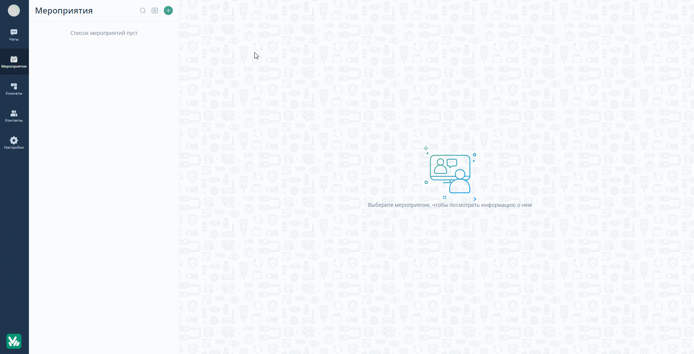

# Как запланировать вебинар

В данной статье вы научитесь планировать проведение Вебинара на площадке ВКУРСЕ.

В нашем приложении вы можете запланировать вебинар на удобную дату и время, настроить его как повторяющееся, включить синхронный перевод, добавить комнату ожидания для неприглашенных участников, обеспечить постоянное отображение участников на видео, а также разделить их на группы. Все настройки и функции можно найти в этой статье.

Для того чтобы запланировать Вебинар выполните следующие шаги:

ШАГ 1: Войдите в личный кабинет на платформе ВКУРСЕ.
Для входа в личный кабинет используйте Логин и Пароль для платформы ВКУРСЕ.

ШАГ 2: В личном кабинете перейдите на вкладку Мероприятия.
Нажмите на комнату Создать мероприятие (знак зеленого плюса)

ШАГ 3: В появившемся окне выберете пункт “Запланировать” кликните на кнопку “Мероприятие”. После этого в правой части экрана откроется окно планирования мероприятия.

