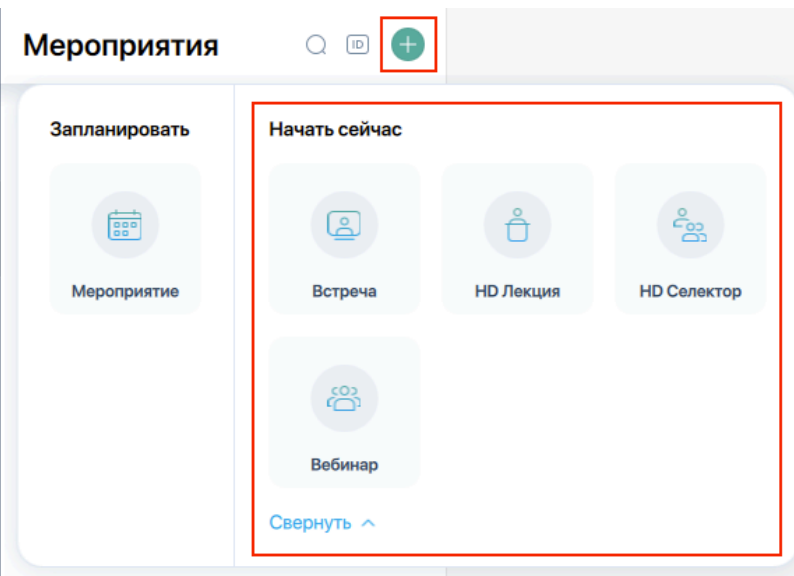
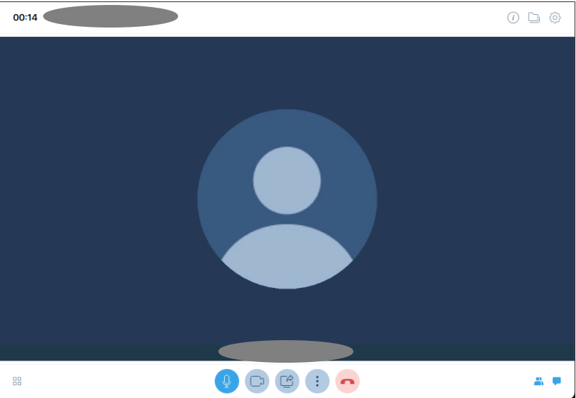
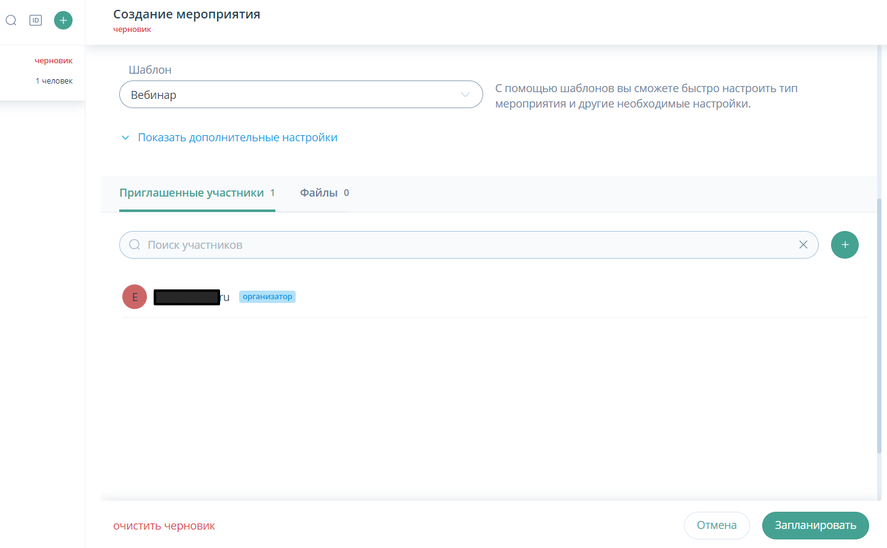
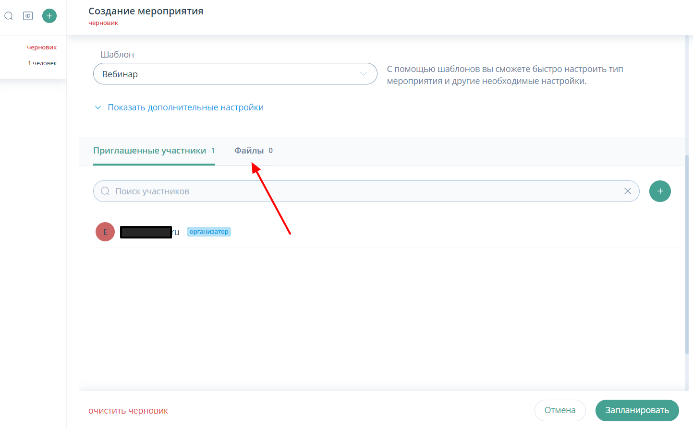
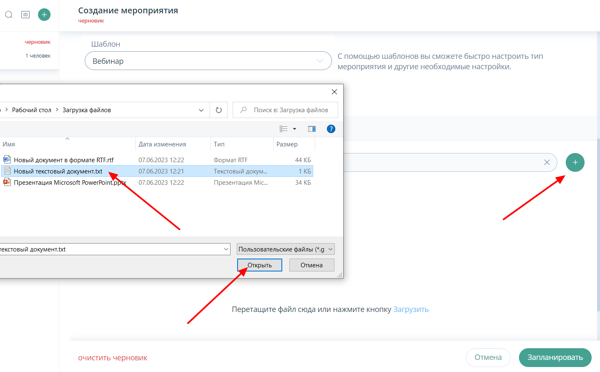
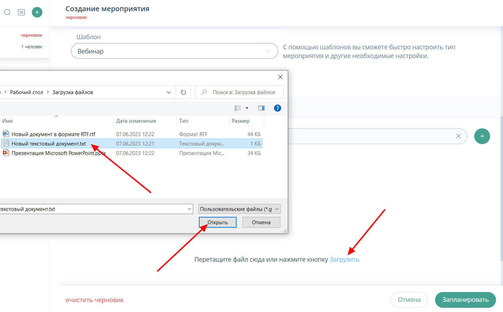
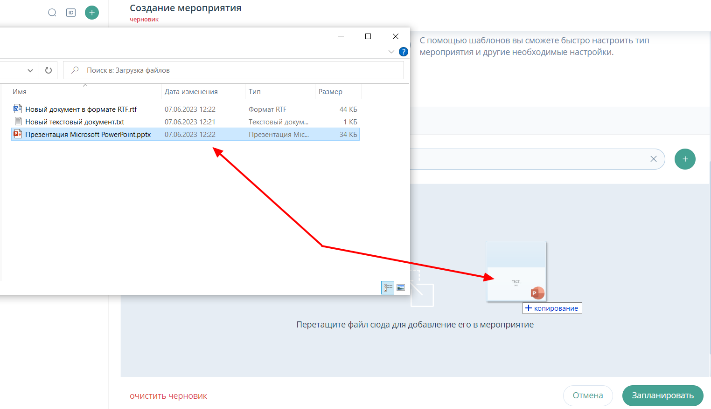
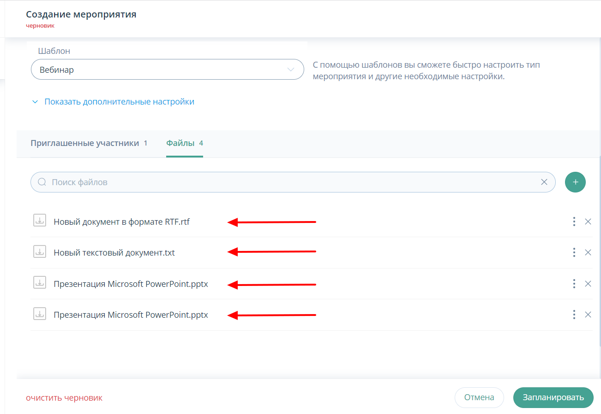
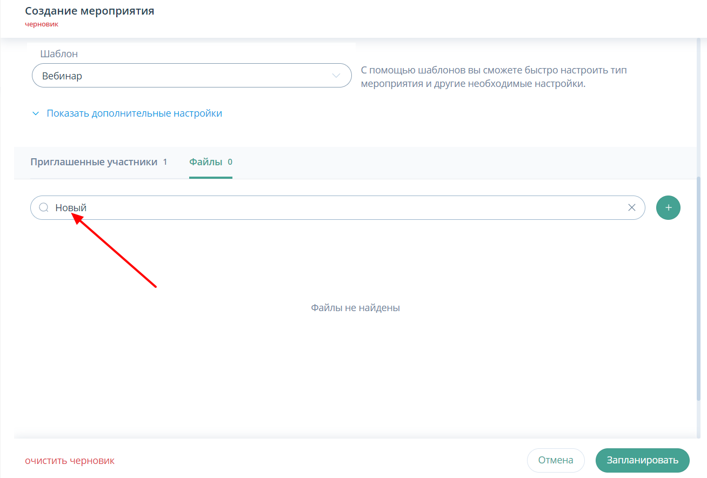

# Подготовка к Вебинару

## Создание мероприятия Вебинар "Начать сейчас" (Браузер)

Создание мероприятия Вебинар "Начать сейчас"

1. Войти в личный кабинет с Логином и Паролем
2. Нажать (плюс) и выбрать из списка кнопку с названием Вебинар
3. Мероприятие создано
4. Нажать "три вертикальных точки" в меню управления (посередине экрана) и выбрать пункт "настройки оборудования"
5. Выбрать из выпадающего соответствующие наушники и динамики
6. Нажать "ПРИМЕНИТЬ"
7. Включить "Микрофон", "Камеру"

<!-- TODO: добавить видео  -->

8. Настройте основные параметры мероприятия (пролистав всю страницу)
9. Перейдите в раздел "Участники" и нажать (плюс) добавьте тех, кто должен участвовать в мероприятии
   9.1 Первый способ: выбрать каждого участника отдельно.
   9.2 Второй способ: добавить через запятую группу участников (до 300 человек)
   9.3 Третий способ: нажать (плюс) и выбрать пункт "Поделиться ссылкой" и разослать её участникам мероприятия доступным способом

<!-- TODO: добавить видео  -->

10. Загрузить файлы
11. Нажать кнопку "Файлы" и в открывшееся окно "перетащить" или выбрать пункт "Загрузить" и добавить необходимые файлы
12. По завершении мероприятия нажать красную кнопку и выбрать пункт "Завершить" мероприятие
13. Ссылка на статью К

## Создание запланированного мероприятия. Вебинар.(Приложение ПК)

Создание запланированного мероприятия Вебинар.

1. Войти в Desktop с Логином, Паролем и Именем Сервера
2. В панели навигации (слева) выбрать пункт "Мероприятия"
3. Нажать (плюс) и выбрать из списка кнопку с названием "Запланировать Мероприятие"
4. Обязательно внести название мероприятия.
5. Выбрать периодичность проведения мероприятия (однократно или многократно)
6. Дату и время начала запланированного мероприятия
7. Внести повестку мероприятия в поле "Описание"
8. ОБЯЗАТЕЛЬНО выбрать необходимый шаблон Вебинар
9. В разделе "Дополнительные настройки" произвести основную настройку мероприятия
10. Добавить фоновое изображение (при необходимости)
11. Кнопкой (плюс) добавить необходимых участников
    11.1 Или: выбрать каждого участника отдельно. (в строке поиска)
12. Назначить права приглашённым участникам (нажав "три вертикальных" точки)
13. Нажать кнопку "Запланировать"

<!-- TODO: вставить видео -->

:::tip Полезная информация.
Статья ["Конфигурация MSI установщика приложения (Приложение ПК Windows)"]()
:::

## Создание мероприятия Вебинар "Начать сейчас" (Приложение ПК)

Создание мероприятия Вебинар "Начать сейчас" (Приложение ПК)

1. Войти в Desktop с Логином, Паролем и Именем Сервера
2. В панели навигации (слева) выбрать пункт "Мероприятия"
3. Нажать (плюс) и выбрать из списка кнопку с названием Вебинар

4. Мероприятие создано

4.1. Одновременно с началом мероприятия на указанную почту поступит электронное письмо, которое будет содержать всю необходимую информацию.

5. Нажать "три вертикальных точки" в меню управления (посередине экрана) и выбрать пункт "настройки оборудования"
   5.1. Включить при необходимости "Запись мероприятия"
   5.2. Запустить при необходимости "Стенограмму"
   5.3. Изменить при необходимости фон
6. Выбрать из необходимое оборудование и после этого "кликнуть" с сторону
7. Включить "Микрофон", "Камеру"
8. Настройте основные параметры мероприятия, нажав "шестеренку" (в правом верхнем углу)
9. Перейдите в раздел "Участники" (справа внизу) и нажать (плюс) добавьте тех, кто должен участвовать в мероприятии
   9.1. Первый способ: выбрать каждого участника отдельно.
   9.2. Второй способ: "поделиться ссылкой" скопировать и переслать удобным вам способом
10. Загрузить файлы
11. Нажать кнопку "Файлы" и в открывшееся окно "перетащить" или выбрать пункт "Загрузить" и добавить необходимые файлы
12. Включить при необходимости "Демонстрацию экрана" (по середине окна) и выбрать вариант демонстрации "Рабочий стол" или "Файлы"
13. По завершении мероприятия нажать красную кнопку и выбрать пункт "Завершить" мероприятие

<!-- TODO: вставить видео -->

:::tip Полезная информация.
Статья ["Конфигурация MSI установщика приложения (Приложение ПК Windows)"]()
:::

## Создание запланированного мероприятия. Вебинар.(Браузер)

Создание запланированного мероприятия Вебинар.

1.Войти в личный кабинет с Логином и Паролем

2.Нажать (плюс) и выбрать из в блоке "Запланировать" кнопку с названием Мероприятия

3.Обязательно внести название мероприятия.

4.Выбрать периодичность проведения мероприятия (однократно или многократно)

5. Дату и время начала запланированного мероприятия

<!-- TODO: вставить видео -->

6.Внести повестку мероприятия в поле "Описание"

7.ОБЯЗАТЕЛЬНО выбрать необходимый шаблон Вебинар

8.В разделе "Дополнительные настройки" произвести основную настройку мероприятия

9.Добавить фоновое изображение (при необходимости)

<!-- TODO: вставить видео -->

10. Кнопкой (плюс) добавить необходимых участников

10.1 Первый способ: выбрать каждого участника отдельно.

10.2 Второй способ: добавить через запятую группу участников (до 300 человек)

10.3Назначить права приглашённым участникам

11.Перейти в раздел "Файлы" и добавить файлы презентации через кнопку (плюс) или перетаскиванием

11.1 Оптимальный, для работы, размер вложения составляет до 1Гб

12.Нажать кнопку "Запланировать"

<!-- TODO: вставить видео -->

## Добавление файлов в запланированное мероприятие Вебинар. (Браузер)

1.Войти в личный кабинет с Логином и Паролем

2.Нажать (плюс) и выбрать из в блоке "Запланировать" кнопку с названием Мероприятия

3.ОБЯЗАТЕЛЬНО выбрать необходимый шаблон Вебинар

4.Перейти в закладку "Файлы"

5.Загрузить файлы:

5.1. Нажав (плюс), в открывшемся окне выбрать необходимую папку, выделить необходимый документ, нажать кнопку "Открыть

5.2. Нажав кнопку "Загрузить", в открывшемся окне выбрать необходимую папку, выделить необходимый документ, нажать кнопку "Открыть"

5.3. Перетащить необходимы файл для добавления его в мероприятие (drag and drop)

6. После добавления необходимого материала, файлы будут отображены списком.

7.Для поиска уже добавленных файлов можно воспользоваться полем "поиск файлов"

