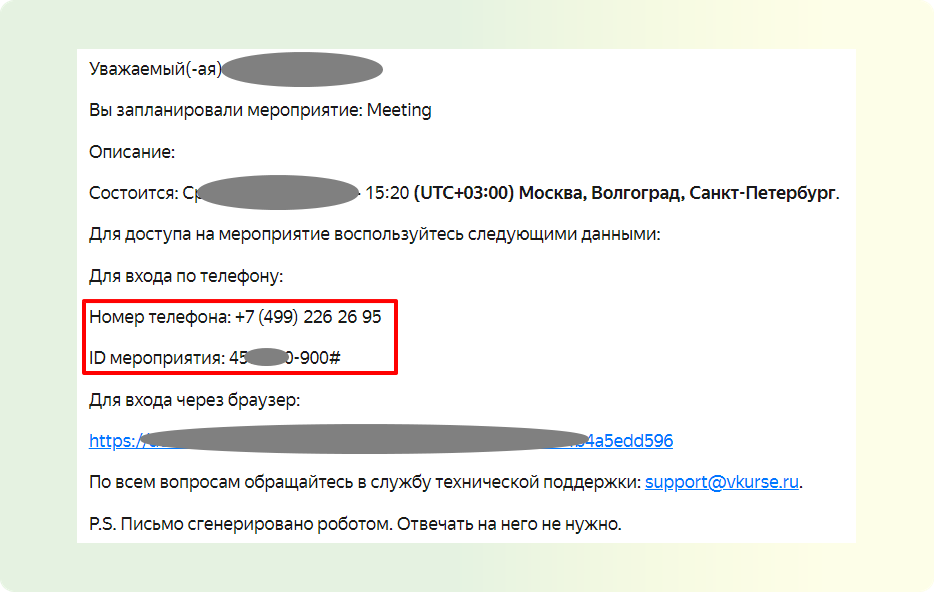

# Основные возможности

## Как позвонить в мероприятие с телефона в аудио формате (Вебинар)

<!-- TODO: Перенести в раздел для участников -->

В данной статье вы научитесь звонить в в мероприятие с телефона в аудио формате на платформе ВКУРСЕ.

Функция звонков в мероприятие позволяет участникам подключаться к мероприятию по телефону. Это удобный способ для людей без доступа к интернету или для тех, кто предпочитает голосовую связь вместо видеосвязи.

**ШАГ 1: Набор номера телефона**

Найдите номер телефона, указанный в приглашении на мероприятие. Наберите этот номер на вашем телефоне.

**ШАГ 2: Ввод ID мероприятия**

После звукового приветствия введите ID мероприятия, который также был указан в приглашении. Это позволит вам подключиться к мероприятию.

**ШАГ 3: Получение данных у организатора/модератора**

Если у вас нет необходимых данных для подключения, обратитесь к организатору или модератору мероприятия для получения актуальной информации.
