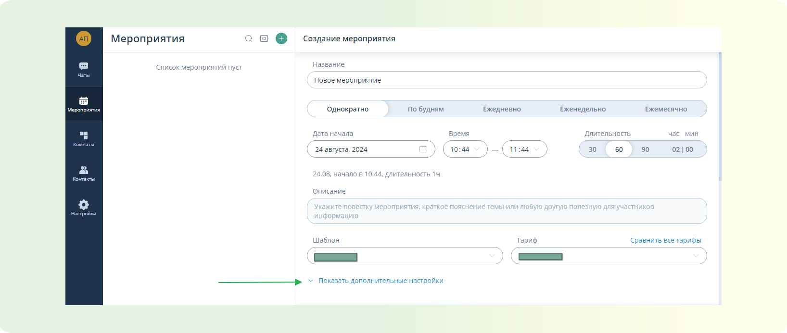
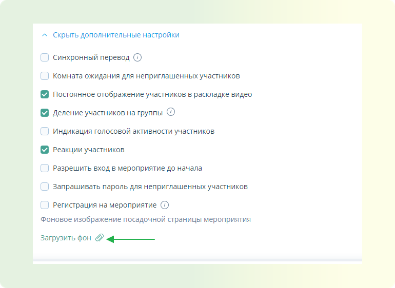
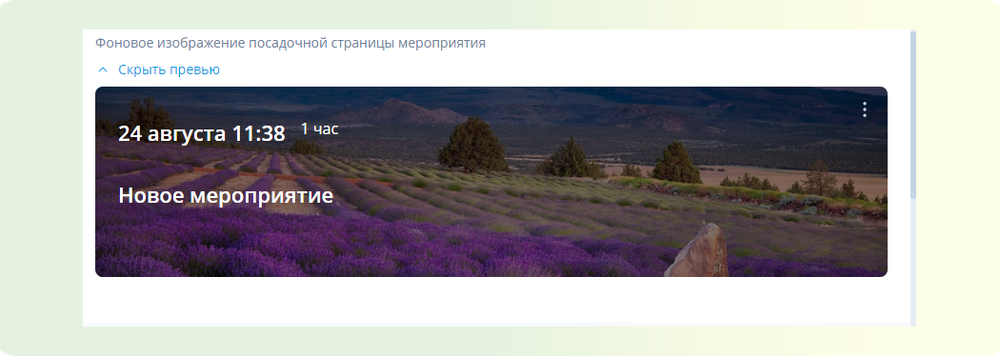
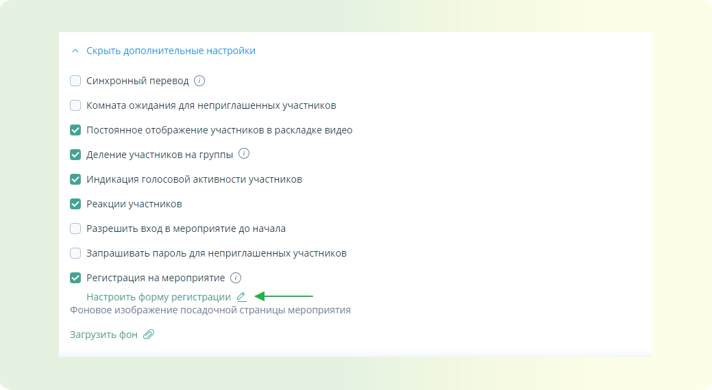
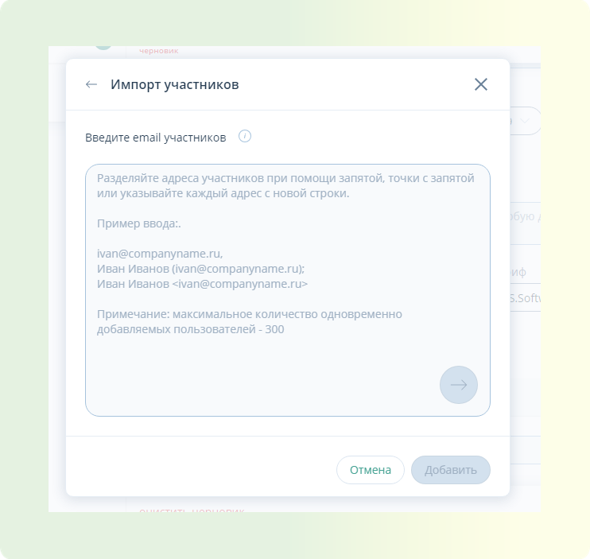

# Подготовка к встрече

<!-- markdownlint-disable MD013 -->

## Как создать Встречу при помощи готового шаблона

В данной статье вы научитесь быстро создавать встречи по готовому шаблону на площадке ВКУРСЕ, со стандартными настройками.

В нашем приложении вы можете создать встречу по готовому шаблону. Готовый шаблон позволяет быстро создать мероприятие, которое запустится автоматически со стандартными настройками.

Давайте создадим Встречу по готовому шаблону.

**ШАГ 1:** Войдите в личный кабинет на платформе ВКУРСЕ.
Для входа в личный кабинет используйте Логин и Пароль для платформы ВКУРСЕ.

<!-- TODO: Как авторизоваться на платформе ВКУРСЕ можно ознакомиться в этой статье (линкуем ссылку к "в этой статье") -->

**ШАГ 2:** В личном кабинете перейдите на вкладку Мероприятия.
Нажмите на комнату Создать мероприятие (знак зеленого плюса).

**ШАГ 3:** В появившемся окне выберите пункт “Начать сейчас” кликните на шаблон Встреча.
После этого мероприятие запустится автоматически.

{.foo}

**ШАГ 4:** После перехода в мероприятие платформа ВКУРСЕ предложит вам настроить оборудование.

<!-- TODO: Подробнее о настройке оборудования для участия в мероприятии можно ознакомиться в этой статье (линкуем ссылку к "в этой статье") -->

**ШАГ 5:** После применения настроек оборудования вам будут доступны функции организатора/модератора данного мероприятия.

<!-- TODO: подробнее о ролях можно ознакомиться в этой статье (линкуем ссылку к "в этой статье"). Подробнее о функционале доступном для организатора/модератора можно ознакомиться в этой статье (линкуем ссылку к "в этой статье") -->

**ШАГ 6:** Для приглашения участников рекомендуем рассылать ссылки для подключения.

<!-- TODO: Подробнее, где взять ссылки для подключения, вы можете узнать в этой статье. (линкуем ссылку к "в этой статье") -->

**ШАГ 7:** Мероприятие создано, участники приглашены, осталось только дождаться подключения участников и начать вещание.

<!-- TODO: Список рекомендованных статей к данному функционалу: -->

## Как запланировать Встречу

В данной статье вы научитесь планировать проведение Встречи на площадке ВКУРСЕ.

В нашем приложении вы можете запланировать встречу на удобную дату и время, настроить ее как повторяющуюся, включить синхронный перевод, добавить комнату ожидания для неприглашенных участников, обеспечить постоянное отображение участников на видео, а также разделить их на группы. Все настройки и функции можно найти в этой статье.

Для того чтобы запланировать Встречу выполните следующие шаги:

**ШАГ 1:** Войдите в личный кабинет на платформе ВКУРСЕ.
Для входа в личный кабинет используйте Логин и Пароль для платформы ВКУРСЕ.

<!-- TODO: Как авторизоваться на платформе ВКУРСЕ можно ознакомится в этой статье (линкуем ссылку к "в этой статье") -->

**ШАГ 2:** В личном кабинете перейдите на вкладку Мероприятия.
Нажмите на комнату Создать мероприятие (знак зеленого плюса)

**ШАГ 3:** В появившемся окне выберете пункт “Запланировать” кликните на кнопку “Мероприятие”. После этого в правой части экрана откроется окно планирования мероприятия.

<!-- TODO: ВСТАВИТЬ КОНТЕНТ ГИФ -->

**ШАГ 4:** Укажите название мероприятия. Выберите будет ли мероприятие однократным или повторяющимся. Укажите точную дату и время старта мероприятия, укажите длительность мероприятия и описание данного мероприятия, если требуется. Выберите шаблон мероприятия "Встреча".

<!-- TODO: ВСТАВИТЬ КОНТЕНТ ГИФ -->

**ШАГ 5:** При выборе шаблона к мероприятию применяются стандартные настройки.

<!-- TODO: Подробнее со списком стандартных настроек вы можете ознакомиться в этой статье.  -->

Для включения или выключения необходимых настроек, кликните по кнопке “Показать дополнительные настройки”.

**ШАГ 6:** В появившемся списке настроек вы можете увидеть список стандартных настроек, которые включены по умолчанию при выборе шаблона Встреча и список дополнительных выключенных настроек.

<!-- TODO: Подробнее с описанием каждого пункта настроек вы можете ознакомиться в этой статье. -->

**ШАГ 7:** Пригласите участников в мероприятие. При планировании доступно два способа приглашения в мероприятие.

1. Пригласить участников по одному при помощи функции “Добавить участников”
2. Пригласить до 300 участников одновременно при помощи функции “Добавить участников - Импорт”
3. После создания мероприятия скопировать необходимые ссылки для подключения из функционала календаря или настроек мероприятия.

<!-- TODO: Подробнее о данных способах приглашения участников можно ознакомиться в этой статье. -->

<!-- TODO: ВСТАВИТЬ КОНТЕНТ ГИФ. -->

**ШАГ 8:** Если вам необходимо назначить сразу модераторов мероприятия, сделать это можно в списке добавленных участников. Для этого найдите необходимого участника в списке - напротив его имени нажмите на три точки - выберете роль для данного участника.

<!-- TODO: Подробнее с функционалом доступным участникам с разными ролями можно ознакомиться в этой статье. -->

**ШАГ 9:** Далее нажмите кнопку “Запланировать”. После этого мероприятие попадет в календарь личного кабинета, а приглашенным будет направлено письмо с ссылками для подключения.

<!-- TODO: ВСТАВИТЬ КОНТЕНТ ГИФ. -->

## Как установить фон в мероприятии

В данной статье вы научитесь, как загрузить и настроить фоновое изображение для страницы мероприятия.

Эта функция позволяет создать уникальную атмосферу мероприятия, визуально подчеркнув его стиль и тематику с помощью привлекательного фонового изображения на посадочной странице.

**ШАГ 1:** Запланируйте мероприятие.

<!-- TODO: Подробнее о том, как запланировать мероприятие. -->

**ШАГ 2:** Откройте дополнительные настройки. При планировании мероприятия найдите и нажмите на кнопку "Показать дополнительные настройки".

**ШАГ 3:** Выбор фонового изображения. Раскройте выпадающий список и выберите пункт "Фоновое изображение посадочной страницы".

**ШАГ 4:** Загрузка фонового изображения. Загрузите изображение, которое будет использоваться в качестве фона. Допустимые форматы файлов: `JPEG`, `JPG`, `PNG`, `BMP`. Максимальный размер изображения: `2048 х 1024` пикселей или меньше при сохранении пропорций.
**ШАГ 5:** Отображение фона. После загрузки выбранное изображение сразу отобразится на посадочной странице.

**ШАГ 6:** Редактирование или удаление фонового изображения. Для изменения или удаления фонового изображения перейдите в меню "три вертикальных точки" и выполните необходимые действия.

## Как создать Встречу с формой регистрации

В данной статье вы научитесь создавать Встречу с формой регистрации на платформе ВКУРСЕ.

Функция "Форма регистрации" на платформе ВКУРСЕ для встречи упрощает процесс регистрации участников. Она позволяет собирать важные данные и эффективно управлять списком участников, что делает вашу встречу более организованной и успешной.

<!-- TODO: Подробнее о том, как создать запланированную Встречу, можете ознакомиться в этой статье.  -->

Давайте рассмотрим, как настроить форму регистрации на вашем мероприятии.

**ШАГ 1:** Основная настройка мероприятия

- Перейдите в раздел "Дополнительные настройки".
- Выберите пункт "Регистрация на мероприятие".
- Перейдите в "Настройки формы регистрации".
- По умолчанию поля e-mail, Имя и Телефон являются обязательными для заполнения.

**ШАГ 2:** Дополнение формы регистрации

- Нажмите, чтобы выбрать и добавить дополнительные пункты к форме регистрации.
- Доступные опции: свободный ввод (одна строка), свободный ввод (абзац), выбор одного варианта из нескольких, выбор нескольких вариантов.

**ШАГ 3:** Завершение настройки

- Нажмите кнопку "Запланировать".
- Встреча с формой регистрации создана.
<!-- TODO: Подробнее о приглашении участников в мероприятие можно узнать в этой статье. -->

## Как пригласить участников в мероприятие при планировании

В данной статье вы научитесь приглашать участников при планировании всеми доступными способами на платформе ВКУРСЕ.

В нашем приложении вы можете приглашать участников в мероприятие тремя способами. Каждый способ по своему уникальный и служит для выполнения разных задач.

Давайте рассмотрим данные способы:

### СПОСОБ 1: Приглашение в мероприятие пользователей по одному при помощи электронной почты участника.

**ШАГ 1:** При планировании мероприятия нажмите кнопку “Добавить участников”(зеленый плюс)

**ШАГ 2:** Выберите участника из доступного контактного списка или введите электронную почту предполагаемого участника в поисковую строку полностью - Поставьте напротив участника галочку - Нажмите кнопку “Добавить”

<!-- TODO: ВСТАВИТЬ КОНТЕНТ ГИФ -->

:::tip ПРИМЕЧАНИЕ
В рамках данного способа, приглашенному на указанную электронную почту поступает персональная ссылка для подключения, по которой войти в мероприятие может только он.
:::

### СПОСОБ 2: Массовое приглашение пользователей в мероприятие при помощи функции “Импорт”(до 300 участников единовременно)

**ШАГ 1:** При планировании мероприятия нажмите кнопку “Добавить участников”(зеленый плюс)

**ШАГ 2:** В окне “Добавление участников” нажмите кнопку “Импорт”

**ШАГ 3:** В поле ввода электронных адресов укажите требуемые адреса, разделяя их запятой, точкой с запятой, или указывайте каждый новый адрес с новой строки

**ШАГ 4:** Нажмите кнопку “Добавить”(зеленая стрелка) - Проверьте корректность электронных адресов - Нажмите кнопку “Добавить”

:::tip ПРИМЕЧАНИЕ
В рамках данного способа, приглашенному на указанную электронную почту поступает персональная ссылка для подключения, по которой войти в мероприятие может только он.
:::

### СПОСОБ 3: Рассылка участникам ссылок для подключения из панели запланированного мероприятия.

**ШАГ 1:** Перейдите во вкладку “Мероприятия” в приложении. Выберете необходимое мероприятие.

**ШАГ 2:** В открывшейся панели мероприятия нажмите кнопку “Дополнительные ссылки” - Откроется окно всех доступных ссылок для подключения к мероприятию.

<!-- TODO: ВСТАВИТЬ КОНТЕНТ ГИФ -->

**ШАГ 3:** Скопируйте необходимые ссылки (для гостя, модератора, организатора) и разошлите необходимым участникам любым удобным способом.

:::tip ПРИМЕЧАНИЕ
В рамках данного способа, вы направляете участнику гостевую ссылку, по которой может подключиться любой пользователь. Если подключение не ограничено настройками мероприятия. Подробнее о настройках мероприятия вы можете ознакомиться в этой статье.
:::

<!-- TODO: СПИСОК СТАТЕЙ. -->

## Как настроить оборудование камеру, микрофон, динамик

В данной статье вы научитесь настраивать оборудование для участия в мероприятиях на платформе ВКУРСЕ.

На нашей платформе вы можете настроить камеру и микрофон как перед началом мероприятия, так и во время него. Это позволяет быстро адаптировать оборудование для комфортного участия и при необходимости легко внести изменения.

Настроить оборудование можно двумя способами. Давайте рассмотрим оба способа.

### СПОСОБ 1: Настройка оборудования в личном кабинете.

**ШАГ 1:** В личном кабинете, на боковой панели, перейдите во вкладку “Настройки” - Кликните на пункт “Оборудование”

**ШАГ 2:** В открывшемся функционале настройки оборудования выберите подключенный микрофон, камеру. Если необходимо, включите шумоподавление, отрегулируйте чувствительность микрофона, громкость звука или включите фон для камеры.

:::warning ВАЖНО
Любые изменения в настройках оборудования на платформе ВКУРСЕ сохраняются автоматически.
:::

**ШАГ 4:** Настройка завершена. При дальнейшем участии в мероприятиях будут применяться ваши настройки.

### СПОСОБ 2: Настройка оборудования при входе в мероприятие или во время проведения.

:::warning ВАЖНО
При входе в мероприятие, если у вас в настройках оборудования включен пункт “Показывать окно настроек при входе”, то вы можете настраивать оборудование при каждом входе в мероприятие.
:::

**ШАГ 1:** В открывшемся функционале настройки оборудования выберете подключенный микрофон, динамик, камеру.

Если необходимо:

- включите функции “Включать камеру, микрофон при входе”
- включите шумоподавление
- отрегулируйте чувствительность микрофона
- отрегулируйте громкость звука
- включите фон для камеры.

**ШАГ 2:** После завершения настроек нажмите кнопку применить

