# Подготовка к встрече десктоп-клиент

## Как создать Встречу при помощи готового шаблона

В данной статье вы научитесь быстро создавать встречи по готовому шаблону на площадке ВКУРСЕ, со стандартными настройками.

В нашем приложении вы можете создать встречу по готовому шаблону. Готовый шаблон позволяет быстро создать мероприятие, которое запустится автоматически со стандартными настройками.

Давайте создадим Встречу по готовому шаблону.

**ШАГ 1:** Войдите в личный кабинет во ВКУРСЕ. Для входа в личный кабинет используйте Логин и Пароль для приложения ВКУРСЕ. Как авторизоваться на платформе ВКУРСЕ можно ознакомиться в этой статье (линкуем ссылку к "в этой статье")

**ШАГ 2:** В личном кабинете перейдите на вкладку Мероприятия.
Нажмите на комнату Создать мероприятие (знак зеленого плюса).

**ШАГ 3:** В появившемся окне выберите пункт “Начать сейчас” кликните на шаблон HD Конференция.
После этого мероприятие запустится автоматически.

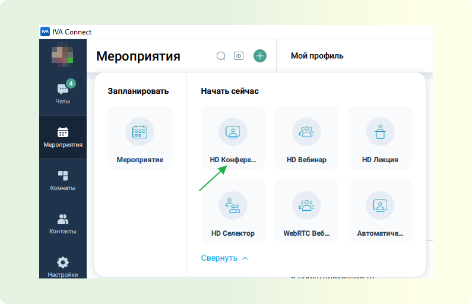

**ШАГ 4:** После перехода в мероприятие платформа ВКУРСЕ предложит вам настроить оборудование. Подробнее о настройке оборудования для участия в мероприятии можно ознакомиться в этой статье (линкуем ссылку к "в этой статье")

**ШАГ 5:** После применения настроек оборудования вам будут доступны функции организатора/модератора данного мероприятия подробнее о ролях можно ознакомиться в этой статье (линкуем ссылку к "в этой статье"). Подробнее о функционале доступном для организатора/модератора можно ознакомиться в этой статье (линкуем ссылку к "в этой статье")

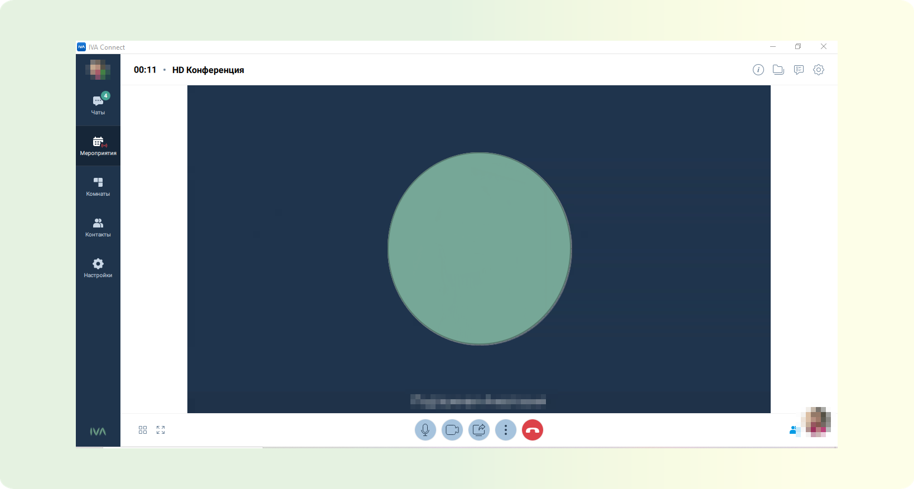

**ШАГ 6:** Для приглашения участников рекомендуем рассылать ссылки для подключения. Подробнее, где взять ссылки для подключения, вы можете узнать в этой статье. (линкуем ссылку к "в этой статье")

**ШАГ 7:** Мероприятие создано, участники приглашены, осталось только дождаться подключения участников и начать вещание.

<!-- TODO: Список рекомендованных статей к данному функционалу: -->

## Как запланировать Встречу

В данной статье вы научитесь планировать проведение Встречи в приложении ВКУРСЕ.

В нашем приложении вы можете запланировать встречу на удобную дату и время, настроить ее как повторяющуюся, добавить комнату ожидания для неприглашенных участников, обеспечить постоянное отображение участников на видео. Все настройки и функции можно найти в этой статье.

Для того чтобы запланировать Встречу выполните следующие шаги:

**ШАГ 1:** Войдите в личный кабинет на платформе ВКУРСЕ.
Для входа в личный кабинет используйте Логин и Пароль для приложения ВКУРСЕ. Как авторизоваться на платформе ВКУРСЕ можно ознакомится в этой статье (линкуем ссылку к "в этой статье")

**ШАГ 2:** В личном кабинете перейдите на вкладку Мероприятия.
Нажмите на комнату Создать мероприятие (знак зеленого плюса)

**ШАГ 3:** В появившемся окне выберете пункт “Запланировать” кликните на кнопку “Мероприятие”. После этого в правой части экрана откроется окно планирования мероприятия.

<!-- TODO: ВСТАВИТЬ КОНТЕНТ ГИФ -->

**ШАГ 4:** Укажите название мероприятия. Выберите будет ли мероприятие однократным или повторяющимся. Укажите точную дату и время старта мероприятия, укажите длительность мероприятия и описание данного мероприятия, если требуется. Выберите шаблон мероприятия Встреча.

<!-- TODO: ВСТАВИТЬ КОНТЕНТ ГИФ -->

**ШАГ 5:** При выборе шаблона к мероприятию применяются стандартные настройки. Подробнее со списком стандартных настроек вы можете ознакомиться в этой статье. Для включения или выключения необходимых настроек, кликните по кнопке “Дополнительные настройки”.

**ШАГ 6:** В появившемся списке настроек вы можете увидеть список стандартных настроек, которые включены по умолчанию при выборе шаблона HD Конференция и список дополнительных выключенных настроек. Подробнее с описанием каждого пункта настроек вы можете ознакомиться в этой статье.

<!-- **ШАГ 7:** Пригласите участников в мероприятие. При планировании доступно два способа приглашения в мероприятие. -->

<!-- 1. Пригласить участников по одному при помощи функции “Добавить участников” -->
<!-- 2. После создания мероприятия скопировать необходимые ссылки для подключения из функционала календаря или настроек мероприятия. -->

<!-- TODO: Подробнее о данных способах приглашения участников можно ознакомиться в этой статье. -->

<!-- TODO: ВСТАВИТЬ КОНТЕНТ ГИФ. -->

**ШАГ 8:** Если вам необходимо назначить сразу модераторов мероприятия, сделать это можно в списке добавленных участников. Для этого найдите необходимого участника в списке - напротив его имени нажмите на три точки - выберете роль для данного участника. Подробнее с функционалом доступным участникам с разными ролями можно ознакомиться в этой статье.

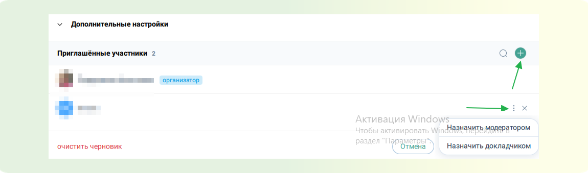

**ШАГ 9:** Далее нажмите кнопку “Запланировать”. После этого мероприятие попадет в календарь личного кабинета, а приглашенным будет направлено письмо с ссылками для подключения.

<!-- TODO: ВСТАВИТЬ КОНТЕНТ ГИФ. -->

## Как пригласить участников в мероприятие при планировании

В данной статье вы научитесь приглашать участников при планировании всеми доступными способами в приложении ВКУРСЕ.

В нашем приложении вы можете приглашать участников в мероприятие двумя способами. Каждый способ по своему уникальный и служит для выполнения разных задач.

Давайте рассмотрим данные способы:

**СПОСОБ 1: Приглашение в мероприятие пользователей по одному при помощи электронной почты участника.**

**ШАГ 1:** При планировании мероприятия нажмите кнопку “Добавить участников”(зеленый плюс)

**ШАГ 2:** Выберите участника из доступного контактного списка или введите электронную почту предполагаемого участника в поисковую строку полностью - Поставьте напротив участника галочку - Нажмите кнопку “Добавить”

<!-- TODO: ВСТАВИТЬ КОНТЕНТ ГИФ -->

:::tip ПРИМЕЧАНИЕ
В рамках данного способа, приглашенному на указанную электронную почту поступает персональная ссылка для подключения, по которой войти в мероприятие может только он.
:::

**СПОСОБ 2: Рассылка участникам ссылок для подключения из панели запланированного мероприятия.**

**ШАГ 1:** Перейдите во вкладку “Мероприятия” в приложении. Выберете необходимое мероприятие.

**ШАГ 2:** В открывшейся панели мероприятия нажмите кнопку “Дополнительные ссылки” - Откроется окно всех доступных ссылок для подключения к мероприятию.

<!-- TODO: ВСТАВИТЬ КОНТЕНТ ГИФ -->

**ШАГ 3:** Скопируйте необходимые ссылки (для гостя, модератора, организатора) и разошлите необходимым участникам любым удобным способом.

:::tip ПРИМЕЧАНИЕ
В рамках данного способа, вы направляете участнику гостевую ссылку, по которой может подключиться любой пользователь. Если подключение не ограничено настройками мероприятия. Подробнее о настройках мероприятия вы можете ознакомиться в этой статье.
:::

<!-- TODO: СПИСОК СТАТЕЙ. -->

## Как настроить оборудование камеру, микрофон, динамик

В данной статье вы научитесь настраивать оборудование для участия в мероприятиях на платформе ВКУРСЕ.

На нашей платформе вы можете настроить камеру и микрофон как перед началом мероприятия, так и во время него. Это позволяет быстро адаптировать оборудование для комфортного участия и при необходимости легко внести изменения.

Давайте рассмотрим этот процесс.

**ШАГ 1:** В личном кабинете, на боковой панели, перейдите во вкладку “Настройки” - Кликните на пункт “Оборудование”

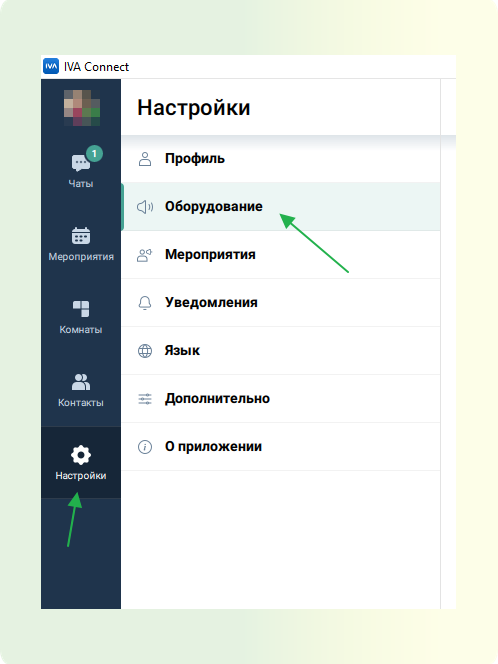

**ШАГ 2:** В открывшемся функционале настройки оборудования выберите подключенный микрофон, камеру. Если необходимо, включите шумоподавление, отрегулируйте чувствительность микрофона, громкость звука или включите фон для камеры.

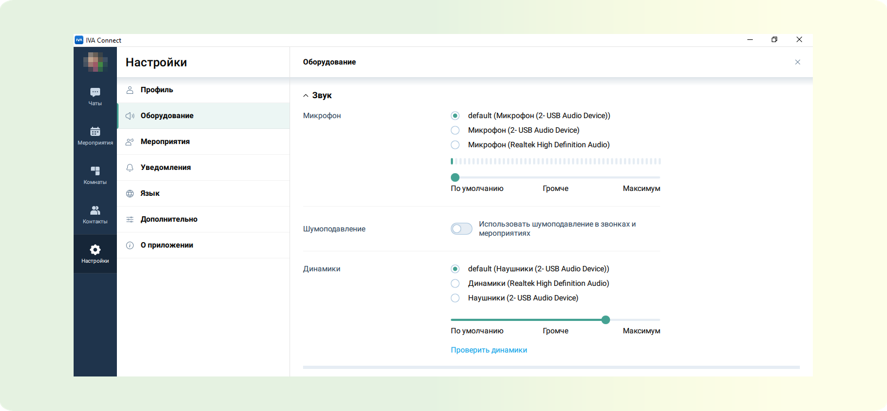

:::warning ВАЖНО
Любые изменения в настройках оборудования на платформе ВКУРСЕ сохраняются автоматически.
:::

**ШАГ 4:** Настройка завершена. При дальнейшем участии в мероприятиях будут применяться ваши настройки.

## Как установить фон в мероприятии

В данной статье вы научитесь, как загрузить и настроить фоновое изображение для страницы мероприятия.

Эта функция позволяет создать уникальную атмосферу мероприятия, визуально подчеркнув его стиль и тематику с помощью привлекательного фонового изображения на посадочной странице.

**ШАГ 1:** Запланируйте мероприятие. Подробнее о том, как запланировать мероприятие.
**ШАГ 2:** Откройте дополнительные настройки. При планировании мероприятия найдите и нажмите на кнопку "Показать дополнительные настройки".

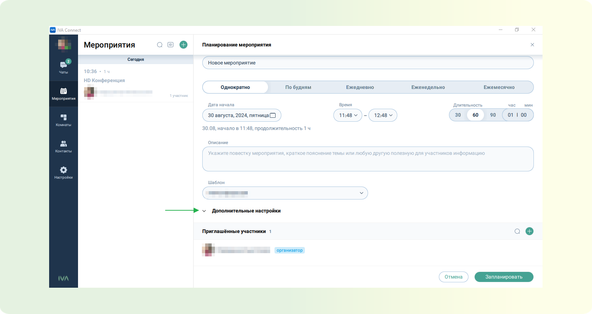

**ШАГ 3:** Выбор фонового изображения. Раскройте выпадающий список и выберите пункт "Загрузить фон".

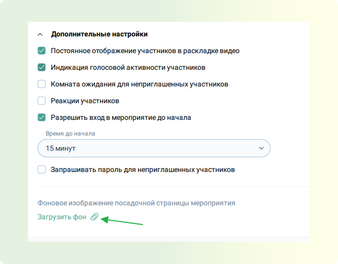

**ШАГ 4:** Загрузка фонового изображения. Загрузите изображение, которое будет использоваться в качестве фона. Допустимые форматы файлов: `JPEG`, `JPG`, `PNG`, `BMP`. Максимальный размер изображения: 2048 х 1024 пикселей или меньше при сохранении пропорций.

**ШАГ 5:** Отображение фона. После загрузки выбранное изображение сразу отобразится на посадочной странице.

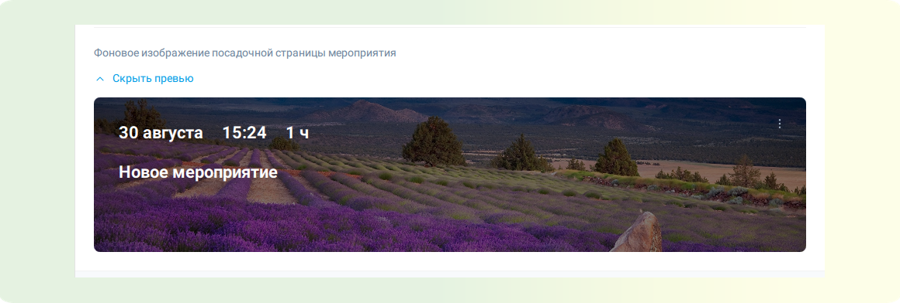

**ШАГ 6:** Редактирование или удаление фонового изображения. Для изменения или удаления фонового изображения перейдите в меню "три вертикальных точки" и выполните необходимые действия.

## Как назначить модератора/докладчика

В данной статье вы научитесь назначать модератора/докладчика в мероприятиях на платформе ВКУРСЕ.

Распределение ролей, таких как модератор и докладчик, необходимо для эффективного управления мероприятием на нашей платформе, обеспечения порядка и четкого выполнения задач участниками.

### Определения

**Организатор/Модератор** - Участник мероприятия с доступом ко всему функционалу управления мероприятием. Различия между организатором и модератором только в том, что организатор - это человек создавший данное мероприятия в своем личном кабинете. Подробней о личном кабинете вы можете ознакомиться в этой статье.

**Докладчик** - Участник мероприятия с возможностью говорить и показывать контент, но без возможности настраивать мероприятие, управлять правами рядовых участников.

**Рядовой участник** - В рамках встречи может все то же самое что и докладчик. В зависимости от настроек мероприятия.

<!-- TODO: Подробней о доступном функционале для каждого типа участников можно ознакомиться в этой статье. -->

Назначение модератора/докладчика возможно тремя способами. Давайте рассмотрим их.

**СПОСОБ 1: Назначение модератора/докладчика при помощи отправки гостевых ссылок для подключения модератора / докладчика**

**ШАГ 1:** Войдите в личный кабинет. Перейдите на вкладку Мероприятия. Войдите в мероприятие.

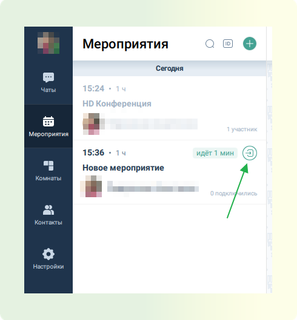

**ШАГ 2:** В мероприятии перейдите в “Настройки”(значок шестеренки). На пункте “Гостевая ссылка для входа” найдите кнопку “расширенные настройки ссылок”, кликните на нее.

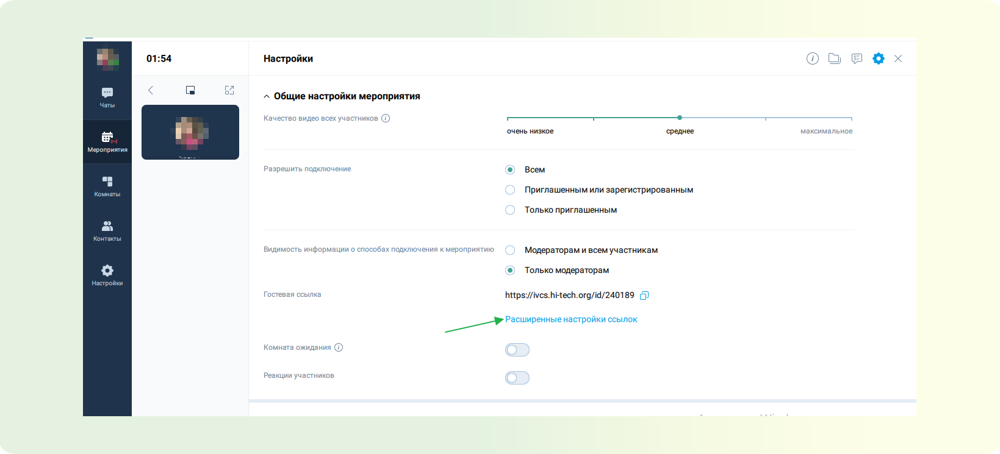

**ШАГ 3:** Из открывшегося списка, скопируйте ссылку для модератора / докладчика и направьте ее участнику любым удобным вам способом.

**СПОСОБ 2: Назначение модератора / докладчика при планировании мероприятия.**

**ШАГ 1:** Во время планирования мероприятия добавьте участника в список участников. Подробней о добавлении участников при планировании можно ознакомиться в этой статье.

**ШАГ 2:** Напротив имени участника нажмите на три вертикальные точки и выберете “Назначить модератором” или “Назначить докладчиком”

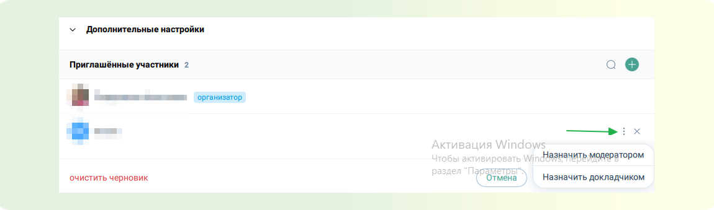

**ШАГ 3:** Нажмите кнопку запланировать. После этого назначенным участникам будет направлено приглашение с персональными ссылками модератора/докладчика и будет указана роль.

**СПОСОБ 3: Назначение модератором/докладчиком, во время проведения мероприятия.**

**ШАГ 1:** Во время проведения мероприятия. Перейдите в панель управления участниками, кликните на необходимого участника из списка.

**ШАГ 2:** Откроется панель настроек участника. В пункте “Роль”, измените роль на необходимую. Подробней о возможностях участников с разными ролями, можно ознакомиться в этой статье.

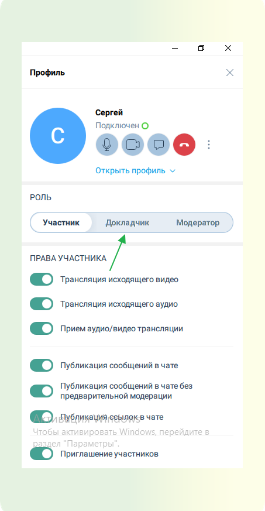
